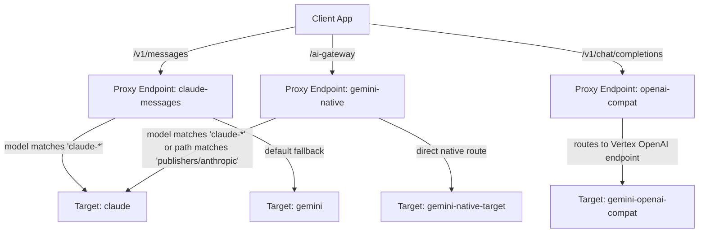

# Apigee LLM Gateway (ai-gateway) API Proxy

This directory contains the Apigee API Proxy implementation for the **AI Gateway**, designed to route, secure, and monitor requests to various LLM providers (Google Vertex AI/Gemini, Anthropic Claude, and OpenAI). 

It enforces prompt/response sanitization via **GCP Model Armor**, manages rolling-window token quotas using **LLMTokenQuota**, and generates detailed token usage analytics.

---

## 🛠 Architecture Overview

The API Gateway exposes three primary basePath routes and distributes traffic to target endpoints based on the requested model.



### 1. Proxy Endpoints
*   **[claude-messages](apiproxy/proxies/claude-messages.xml):** Exposes `/v1/messages`. Accepts Claude-format requests and translates/routes them appropriately.
*   **[gemini-native](apiproxy/proxies/gemini-native.xml):** Exposes `/ai-gateway`. Accepts native Gemini REST API payloads directly, as well as native Vertex AI Anthropic Claude raw predict payloads.
*   **[openai-compat](apiproxy/proxies/openai-compat.xml):** Exposes `/v1/chat/completions`. Accepts standard OpenAI completions payloads and routes them to Vertex AI's OpenAI-compatible multi-region endpoint.

### 2. Target Endpoints
*   **[claude](apiproxy/targets/claude.xml):** Points to Vertex AI Anthropic Claude API.
*   **[gemini](apiproxy/targets/gemini.xml):** Points to Vertex AI Gemini API (used when translating Claude-format inputs to Gemini).
*   **[gemini-native-target](apiproxy/targets/gemini-native-target.xml):** Points to native Vertex AI Gemini API.
*   **[gemini-openai-compat](apiproxy/targets/gemini-openai-compat.xml):** Points to Vertex AI's Global/Multi-region OpenAI Compatibility endpoint for Gemini.

---

## 🔒 Security (GCP Model Armor Sanitization)

Prompt and response sanitization are enforced at the message flow boundaries.

*   **Request Sanitization:**
    *   **Claude/OpenAI Routes:** Prompt is extracted via [JS-extract-prompt](apiproxy/policies/JS-extract-prompt.xml) and evaluated by [SUP-SanitizeUserPrompt](apiproxy/policies/SUP-SanitizeUserPrompt.xml).
    *   **Gemini Native Route:** 
        *   For Gemini payloads, actual text segments in the request history are parsed via [JS-extract-vars-gemini](apiproxy/policies/JS-extract-vars-gemini.xml) (ignoring tool calls/responses) and evaluated by [SUP-SanitizeUserPromptGemini](apiproxy/policies/SUP-SanitizeUserPromptGemini.xml).
        *   For Claude payloads, prompts are parsed from the messages structure via [JS-extract-vars-gemini](apiproxy/policies/JS-extract-vars-gemini.xml) and evaluated by [SUP-SanitizeUserPrompt](apiproxy/policies/SUP-SanitizeUserPrompt.xml).
*   **Response Sanitization:** Model completions are evaluated by [SMR-SanitizeModelResponse](apiproxy/policies/SMR-SanitizeModelResponse.xml) before being streamed back to the client.
*   **Custom Error Injection:** If Model Armor filters match any violations, [JS-inject-deidentified-finding](apiproxy/resources/jsc/inject_deidentified_finding.js) extracts the exact violations and [AM-CustomError](apiproxy/policies/AM-CustomError.xml) constructs a clean custom error response.

---

## 📊 Quota & Token Management

Token usage is tracked using Apigee's **LLMTokenQuota** policy in rolling window mode (`LTQ-EnforceOnly` & `LTQ-CountOnly`), which enforces and counts tokens strictly based on the associated API Product configuration when authenticated via API Key.

### 1. Non-Streaming Scenario
*   Apigee extracts token counts from response headers/bodies via **ExtractVariables** (e.g. [EV-ExtractMetadataNonStreamingGemini](apiproxy/policies/EV-ExtractMetadataNonStreamingGemini.xml)).
*   [JS-calculate-tokens-non-streaming](apiproxy/policies/JS-calculate-tokens-non-streaming.xml) sums the tokens and populates `usage_total_tokens`.
*   Quota count-only policies are then executed in the PostFlow Response.

### 2. Streaming Scenario
*   For streaming requests (`stream: true`), PostFlow steps are skipped (`!(stream = true)` condition).
*   Instead, token usage is captured in the **Target Endpoint `<EventFlow>`** using the [JS-combine-resp](apiproxy/policies/JS-combine-resp.xml) policy, which parses streaming chunks, extracts incremental token usage, and triggers rolling window quota deduction.

> [!IMPORTANT]
> **Gemini Native Streaming Constraint:**
> By default, the native Gemini `:streamGenerateContent` endpoint returns `application/json`, bypassing Apigee's standard SSE `EventFlow` triggers.
>
> To force Apigee to run `EventFlow` and count tokens during Gemini Native streams, **clients must send the `?alt=sse` query parameter** in their requests. This forces the Gemini backend to return a `text/event-stream` content-type.

---

## 🧪 Verification & Test Scripts

There are several test scripts located in the root directory to validate proxy logic:

### Non-Streaming & OpenAI compatibility Tests
*   **[test-claude.sh](test-claude.sh):** Sends 15 test cases (safe, SQLi, toxic, PII) to the Claude endpoint in non-streaming mode.
*   **[test-gemini-native.sh](test-gemini-native.sh):** Tests the non-streaming Gemini route using `:generateContent`.
*   **[test-gemini-native-claude.sh](test-gemini-native-claude.sh):** Tests routing to Claude models from the Gemini native endpoint (`/ai-gateway`) in both non-streaming (`:rawPredict`) and streaming (`:streamRawPredict`) modes.
*   **[test-openai-compat.sh](test-openai-compat.sh):** Tests the new OpenAI completions compatibility endpoint (`/v1/chat/completions`) in both streaming and non-streaming modes.

### Streaming Tests
*   **[test-claude-stream.sh](test-claude-stream.sh):** Tests Claude route streaming (`stream: true`), verifying EventFlow and Model Armor blocks.
*   **[test-gemini-native-stream.sh](test-gemini-native-stream.sh):** Tests Gemini Native route streaming, appending `?alt=sse` to test target EventFlow execution.

---

## 🚀 Deployment Instructions (apigeecli)

Before deploying, ensure you have:
1. Created the service account `consumer-sa@your-project-id.iam.gserviceaccount.com` in your Google Cloud project with sufficient permissions to call Model Armor, Gemini models, and Model Garden models (such as `roles/aiplatform.user` and Model Armor execution permissions).
2. Created the required Data Collectors in your Apigee organization (make sure you have [apigeecli installed](https://github.com/apigee/apigeecli)):

```bash
# Prompt Token Count Collector
~/.apigeecli/bin/apigeecli datacollectors create -o your-org -n dc_prompt_token_count -p INTEGER --default-token

# Completion Token Count Collector
~/.apigeecli/bin/apigeecli datacollectors create -o your-org -n dc_completion_token_count -p INTEGER --default-token

# Total Token Count Collector
~/.apigeecli/bin/apigeecli datacollectors create -o your-org -n dc_total_token_count -p INTEGER --default-token

# Model Name Collector
~/.apigeecli/bin/apigeecli datacollectors create -o your-org -n dc_model -p STRING --default-token
```

To deploy the API Proxy bundle directly to your Apigee organization:

```bash
~/.apigeecli/bin/apigeecli apis create bundle \
  -n ai-gateway \
  -o your-project-id \
  -e qa \
  -f ./apiproxy \
  --sa consumer-sa@your-project-id.iam.gserviceaccount.com \
  --ovr \
  --default-token
```
