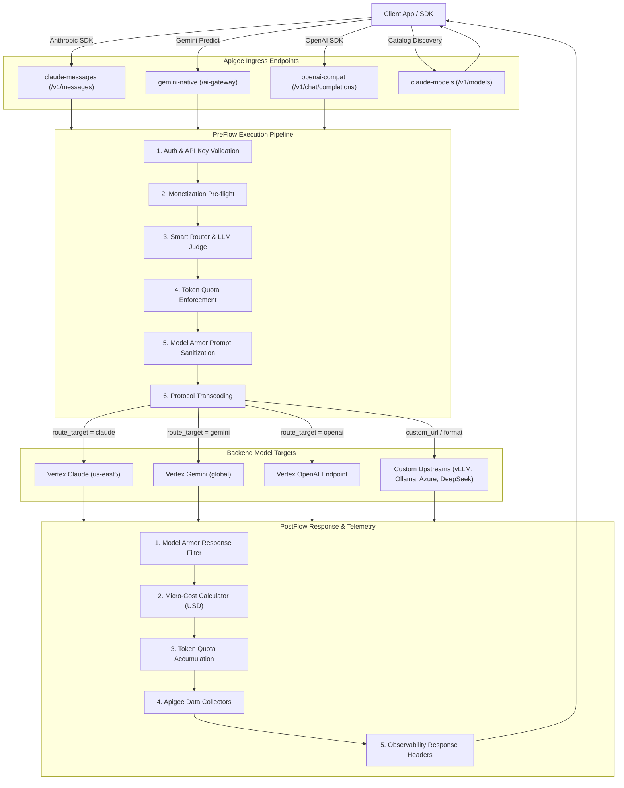

# Apigee Enterprise AI Gateway (`ai-gateway`)

[](https://ra2085.github.io/ai-gw-sample/)
[](https://github.com/apigee/apigee-go-gen)
[](LICENSE)

An enterprise-grade, production-ready **AI Gateway** on Google Cloud Apigee, featuring **Universal Protocol Normalization**, **Smart Routing & LLM as a Judge**, **GCP Model Armor Security**, **Token Quotas**, and **Apigee Monetization with Real-Time Micro-Transactions Tracking**.

---

## Documentation Site

Full guides, architecture specifications, and API references are available on our documentation site:

**[https://ra2085.github.io/ai-gw-sample/](https://ra2085.github.io/ai-gw-sample/)**

---

## Progressive Adoption Journey

The repository is organized for a progressive learning curve:

1. **Quickstart (5 Minutes)**: Deploy a working gateway with minimal configuration supporting Gemini and Claude.
2. **Custom Providers & URLs**: Bring your own models (Azure, DeepSeek, Mistral, Ollama, vLLM) with custom auth.
3. **Enterprise Governance**: Turn on Model Armor security, token quotas, and monetization as needed.
4. **Smart Routing**: Enable AI-driven complexity classification and cost tier routing.

---

## Key Highlights

* **Universal Protocol Normalization:** Query Anthropic Claude, Google Gemini on Vertex AI, or self-hosted OpenAI models using Anthropic (`/v1/messages`), Gemini (`/ai-gateway`), or OpenAI (`/v1/chat/completions`) schemas with real-time SSE streaming translation.
* **Smart Routing & LLM Judge:** Optimize cost and performance using abstract cost tiers (`low`, `medium`, `high`, `max`), fallback chains, or real-time prompt complexity classification powered by Gemini 3.1 Flash-Lite.
* **Enterprise Security:** Automated prompt and response sanitization via GCP Model Armor to prevent data leakage and prompt injection.
* **Token Monetization:** Pre-flight prepaid wallet balance verification and real-time micro-transaction token billing.
* **Custom URLs & Multi-Cloud LLMs:** Declare custom target URLs and formats (`openai`, `anthropic`, `gemini`) in `values.yaml` to route to self-hosted vLLM/Ollama or Azure OpenAI instances.
* **Declarative Helm-Style Templates:** Powered by [`apigee-go-gen`](https://github.com/apigee/apigee-go-gen) to compile clean Apigee proxy bundles in seconds.

---

## Architecture Overview



---

## Quickstart (5 Minutes)

### 1. Define Your Gateway in `values.quickstart.yaml`

```yaml
gateway:
  name: "ai-gateway"
  project_id: "your-gcp-project-id"

models:
  - name: "gemini-2.5-flash"
    displayName: "Gemini 2.5 Flash"
    publisher: "google"
    format: "gemini"
    region: "global"
    is_default: true

  - name: "claude-haiku-4-5"
    displayName: "Claude 4.5 Haiku"
    publisher: "anthropic"
    format: "anthropic"
    region: "us-east5"

  # Optional: Custom Self-Hosted Model in 4 lines
  - name: "my-vllm-model"
    displayName: "Llama 3 (Self-Hosted)"
    format: "openai"
    custom_url: "https://vllm.internal.corp/v1/chat/completions"
```

### 2. Render and Deploy

```bash
# Render bundle using apigee-go-gen
apigee-go-gen render apiproxy \
    --template ./templates/ai-gateway/apiproxy.yaml \
    --values ./templates/ai-gateway/values.quickstart.yaml \
    --output ./out/ai-gateway.zip

# Deploy to Apigee
apigeecli apis create bundle \
    --proxy-zip ./out/ai-gateway.zip \
    --name ai-gateway \
    --org "$PROJECT_ID" \
    --env "$APIGEE_ENV" \
    --ovr \
    --wait \
    --default-token
```

---

## Documentation Index

Explore the complete guides on the **[Documentation Site](https://ra2085.github.io/ai-gw-sample/)**:

| Section | Description |
| :--- | :--- |
| **[5-Minute Quickstart](https://ra2085.github.io/ai-gw-sample/getting-started/quickstart-template/)** | Get a gateway running immediately with minimal configuration. |
| **[Choose Your Workflow](https://ra2085.github.io/ai-gw-sample/getting-started/choose-workflow/)** | Declarative Template approach vs. Native Proxy structure. |
| **[Custom Providers & URLs](https://ra2085.github.io/ai-gw-sample/template-guide/custom-urls/)** | Connect self-hosted vLLM/Ollama, Azure OpenAI, or DeepSeek endpoints. |
| **[Configuration Reference](https://ra2085.github.io/ai-gw-sample/template-guide/configuration/)** | Schema reference for models, pricing, feature flags, and routing tiers. |
| **[Feature Toggles](https://ra2085.github.io/ai-gw-sample/template-guide/feature-flags/)** | Enable or disable security, quotas, judge, and monetization modules. |
| **[Protocol Normalization](https://ra2085.github.io/ai-gw-sample/architecture/protocols/)** | Deep dive into Anthropic, Gemini, and OpenAI request/response/SSE transcoding. |
| **[Smart Routing & LLM Judge](https://ra2085.github.io/ai-gw-sample/architecture/routing/)** | Real-time prompt complexity classifier and fallback chains. |
| **[Enterprise Security](https://ra2085.github.io/ai-gw-sample/architecture/security/)** | Prompt and response sanitization with GCP Model Armor. |
| **[Token Monetization](https://ra2085.github.io/ai-gw-sample/architecture/monetization/)** | Pre-flight wallet balance checks and real-time micro-cost rating engine. |
| **[Deployment & CI/CD](https://ra2085.github.io/ai-gw-sample/operations/deployment/)** | Service accounts, deployment automation, and automated test suites. |

