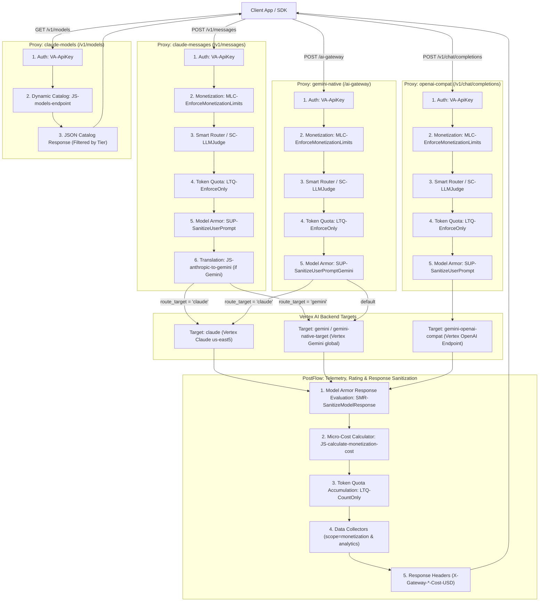
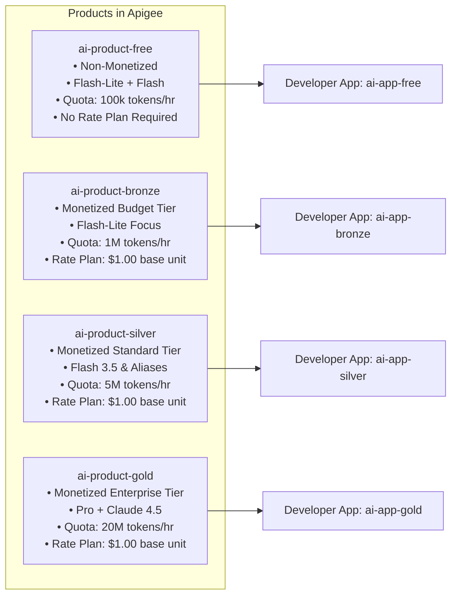

# 🚀 Apigee AI Gateway (`ai-gateway`)

An enterprise-grade **AI Gateway** built on Google Cloud Apigee, featuring **Universal Protocol Normalization**, **Smart Routing & LLM Judge**, **GCP Model Armor Security**, **Token Quota Enforcement**, and **Apigee Monetization with Micro-Transactions Tracking**.

---

## 📑 Table of Contents

- [Architectural Overview](#-architectural-overview)
- [Monetization & Micro-Transactions Engine](#-monetization--micro-transactions-engine)
- [3-Tier AI Product Strategy](#-3-tier-ai-product-strategy)
- [Smart Routing Engine & LLM Judge](#-smart-routing-engine--llm-judge)
- [Enterprise Security (GCP Model Armor)](#-enterprise-security-gcp-model-armor)
- [Telemetry & Analytics Data Collectors](#-telemetry--analytics-data-collectors)
- [Dynamic Model Catalog (`/v1/models`)](#-dynamic-model-catalog-v1models)
- [Deployment & Operational Guide](#-deployment--operational-guide)
- [Verification & Test Suites](#-verification--test-suites)

---

## 🏛 Architectural Overview

The AI Gateway provides a unified control plane for generative AI workloads across Anthropic Claude, OpenAI, and Google Gemini models on Vertex AI:



### Proxy Endpoints

| Endpoint | Base Path | Input Format | Target Providers | Key Capabilities |
| :--- | :--- | :--- | :--- | :--- |
| **`claude-messages`** | `/v1/messages` | Anthropic Claude | Claude (`us-east5`), Gemini (`global`) | Smart Routing, Fallbacks, Judge, Protocol Translation, Monetization |
| **`gemini-native`** | `/ai-gateway` | Native Gemini / Vertex Predict | Gemini (`global`), Claude (`us-east5`) | ADK Compatibility, Native Gemini Streaming, Monetization |
| **`openai-compat`** | `/v1/chat/completions` | OpenAI ChatCompletions | Gemini OpenAI Endpoint | OpenAI SDK Compatibility, Tool Calling, Monetization |
| **`claude-models`** | `/v1/models` | OpenAI / Anthropic Catalog | In-memory Propertyset Catalog | Dynamic Catalog Lookup, API Product Entitlement Filtering |

---

## 💳 Monetization & Micro-Transactions Engine

The gateway natively integrates with **Apigee Monetization** to track and bill LLM consumption on a per-token micro-transaction basis.

### 1. Pre-flight Credit Enforcement (`MonetizationLimitsCheck`)
* Attached in the **PreFlow Request** immediately after API key verification (`VA-ApiKey`).
* **Non-Monetized Products:** If an API Product does not have an active rate plan, Apigee treats it as non-monetized and allows requests to pass through with zero overhead.
* **Monetized Products:** If a rate plan is active, Apigee validates that the developer has an active subscription and sufficient prepaid wallet balance. If funds are depleted, it halts execution **before** making the backend LLM call, preventing costly model execution fees.

```xml
<Step>
  <Name>MLC-EnforceMonetizationLimits</Name>
</Step>
```

### 2. Micro-Transaction Cost Calculator (`JS-calculate-monetization-cost`)
Executed in the **PostFlow Response** to compute exact dollar costs based on model-specific input/output token rates:

$$\text{Total Cost (USD)} = \left[ \left( \frac{\text{Prompt Tokens}}{10^6} \times \text{Input Rate} \right) + \left( \frac{\text{Completion Tokens}}{10^6} \times \text{Output Rate} \right) \right] \times \text{Markup Multiplier}$$

* **Propertyset Driven:** Base rates are loaded from [`monetization_rates.properties`](apiproxy/resources/properties/monetization_rates.properties).
* **Streaming & Non-Streaming:** Inspects both `prompt_tokens` / `completion_tokens` (non-streaming) and `usage_prompt_tokens` / `usage_completion_tokens` (SSE stream trailers).
* **Long Context Tiering:** Automatically applies $2\times$ multipliers for prompts exceeding $128,000$ tokens on supported Gemini models.
* **Apigee Monetization Rating Engine Variables:** Populates `perUnitPriceMultiplier`, `currency`, and `transactionSuccess` to trigger dynamic wallet deductions.

### 3. Monetization Data Collectors (`scope="monetization"`)
Apigee's Monetization rating engine uses dedicated system Data Collectors to rate each API call and deduct funds from the developer's prepaid wallet balance:

```xml
<Capture>
  <Collect ref="perUnitPriceMultiplier" default="1.0"/>
  <DataCollector scope="monetization">perUnitPriceMultiplier</DataCollector>
</Capture>
<Capture>
  <Collect ref="currency" default="USD"/>
  <DataCollector scope="monetization">currency</DataCollector>
</Capture>
<Capture>
  <Collect ref="transactionSuccess" default="true"/>
  <DataCollector scope="monetization">transactionSuccess</DataCollector>
</Capture>
```

* **Dynamic Rating Formula:** The Rate Plan defines a base consumption unit rate of **$1.00 USD**. Apigee Monetization calculates:
  $$\text{Charged Amount} = \text{Base Unit Rate } (1.00\text{ USD}) \times \text{perUnitPriceMultiplier} = \text{Calculated Micro-Cost (USD)}$$
* **Prepaid Wallet Deduction:** The resulting charged amount is automatically deducted from the developer's prepaid wallet balance in real time.

### 4. Model Pricing Matrix (USD per 1,000,000 Tokens)

| Model ID | Input Rate / 1M | Output Rate / 1M | Tier | Official Provider Rate |
| :--- | :--- | :--- | :--- | :--- |
| **`gemini-3.1-flash-lite`** | **\$0.075** | **\$0.30** | Low / Flash-Lite | Vertex AI Generative AI GA |
| **`gemini-3.5-flash-lite`** | **\$0.075** | **\$0.30** | Low / Flash-Lite | Vertex AI Generative AI GA |
| **`gemini-2.5-flash`** | **\$0.100** | **\$0.40** | Medium / Balanced | Vertex AI Generative AI GA |
| **`gemini-3.5-flash`** | **\$0.100** | **\$0.40** | Medium / Balanced | Vertex AI Generative AI GA |
| **`gemini-3.7-flash`** | **\$0.150** | **\$0.60** | Fast / Hybrid | Vertex AI Generative AI GA |
| **`gemini-2.5-pro`** | **\$1.250** | **\$5.00** | High / Reasoning | Vertex AI Generative AI GA |
| **`claude-haiku-4-5`** | **\$1.000** | **\$5.00** | Max / Enterprise | Anthropic on Vertex AI |
| **`claude-3-5-sonnet`** | **\$3.000** | **\$15.00** | Max / Frontier | Anthropic on Vertex AI |

---

## 🏆 Multi-Tier AI Product Strategy

The API is packaged into monetized commercial tiers and a non-monetized free tier across environments `["dev", "qa"]`:



### Product Capabilities Matrix

| Feature | Free Tier (`ai-product-free`) | Bronze Tier (`ai-product-bronze`) | Silver Tier (`ai-product-silver`) | Gold Tier (`ai-product-gold`) |
| :--- | :--- | :--- | :--- | :--- |
| **Monetization** | **Non-Monetized (Free)** | **Monetized (Prepaid)** | **Monetized (Prepaid)** | **Monetized (Prepaid)** |
| **Allowed Models** | `gemini-3.1-flash-lite`, `gemini-3.5-flash-lite`, `gemini-2.5-flash`, `gemini-3.5-flash` | `gemini-3.1-flash-lite`, `gemini-3.5-flash-lite` | Bronze + `gemini-3.5-flash`, `gemini-2.5-flash`, `gemini-3.7-flash` | Silver + `gemini-2.5-pro`, `claude-haiku-4-5`, `claude-3-5-sonnet` |
| **Smart Routing / Judge** | Auto-Routing (`low`, `auto:judge`) | Low Tier Auto-Routing | Low & Medium Auto-Routing | All Tiers (Low, Med, High, Max) + Full LLM Judge |
| **Hourly Token Quota** | **100,000 tokens/hr** | **1,000,000 tokens/hr** | **5,000,000 tokens/hr** | **20,000,000 tokens/hr** |
| **Billing Model** | No Billing / Pass-Through | Prepaid Pay-As-You-Go | Prepaid Standard | Prepaid Enterprise Volume Discount |

---

## ⚡ Smart Routing Engine & LLM Judge

The gateway supports dynamic, policy-driven model routing without requiring client application code changes:

### 1. Cascading Fallback Chains (`models: [...]`)
Supply an ordered array of fallback candidates:
```json
{
  "models": ["claude-haiku-4-5", "gemini-3.5-flash", "gemini-3.1-flash-lite"],
  "messages": [{"role": "user", "content": "Analyze quarterly earnings."}]
}
```

### 2. Auto-Router & Cost-Tier Optimization
Optimize model routing based on budget constraints:
```json
{
  "plugins": [{"id": "auto-router", "cost_tier": "low"}],
  "messages": [{"role": "user", "content": "Extract customer names from this email."}]
}
```
* `cost_tier: "low"` $\to$ **Gemini 3.1 Flash-Lite** (`global`)
* `cost_tier: "medium"` $\to$ **Gemini 3.5 Flash** (`global`)
* `cost_tier: "high"` $\to$ **Gemini 2.5 Pro** (`global`)
* `cost_tier: "max"` $\to$ **Claude 4.5 Haiku** (`us-east5`)

### 3. LLM as a Judge (Real-Time Classifier)
Features an integrated **LLM as a Judge** service callout ([`SC-LLMJudge.xml`](apiproxy/policies/SC-LLMJudge.xml)) powered by **Gemini 3.1 Flash-Lite**:
* Evaluates prompt complexity ($1 - 10$) and task taxonomy (`coding`, `reasoning`, `summarization`, `simple_chat`).
* Automatically selects the optimal cost tier and model at runtime.
* **Payload-Driven Triggers:** `{"model": "auto:judge"}`, `{"model": "gateway/judge"}`, `{"plugins": [{"id": "judge"}]}`.

---

## 🔒 Enterprise Security (GCP Model Armor)

Security filters are applied at request and response boundaries:

* **Prompt Sanitization:** Evaluated via [`SUP-SanitizeUserPrompt.xml`](apiproxy/policies/SUP-SanitizeUserPrompt.xml) and [`SUP-SanitizeUserPromptGemini.xml`](apiproxy/policies/SUP-SanitizeUserPromptGemini.xml) using the template configured in [`config.properties`](apiproxy/resources/properties/config.properties).
* **Response Sanitization:** Model completions are evaluated via [`SMR-SanitizeModelResponse.xml`](apiproxy/policies/SMR-SanitizeModelResponse.xml).
* **De-identification Findings:** Violations trigger custom error injection via [`JS-inject-deidentified-finding.js`](apiproxy/resources/jsc/inject_deidentified_finding.js).

---

## 📊 Telemetry & Analytics Data Collectors

Every transaction logs comprehensive telemetry to Apigee Analytics via Data Capture:

| Data Collector | Type | Description |
| :--- | :--- | :--- |
| `dc_tx_cost_usd` | `STRING` | Micro-transaction cost in USD (e.g. `0.000290`). |
| `dc_prompt_token_count` | `INTEGER` | Billed prompt input token count. |
| `dc_completion_token_count` | `INTEGER` | Billed completion output token count. |
| `dc_total_token_count` | `INTEGER` | Total token consumption count. |
| `dc_model` | `STRING` | Effective model that processed the request. |
| `dc_requested_model` | `STRING` | Original consumer request intent. |

### Observability Response Headers

```http
HTTP/1.1 200 OK
Content-Type: application/json
X-Gateway-Requested-Model: auto:judge
X-Gateway-Routed-Model: gemini-3.5-flash
X-Gateway-Prompt-Tokens: 1500
X-Gateway-Completion-Tokens: 350
X-Gateway-Total-Tokens: 1850
X-Gateway-Prompt-Cost-USD: 0.000150
X-Gateway-Completion-Cost-USD: 0.000140
X-Gateway-Total-Cost-USD: 0.000290
X-Gateway-Cost-Currency: USD
```

---

## 📦 Dynamic Model Catalog (`/v1/models`)

Clients can discover available models and their entitlements dynamically via standard OpenAI/Anthropic catalog requests:

```bash
curl -s -H "x-apikey: $API_KEY" "https://eval.iloveapi.management/v1/models"
```

The catalog dynamically filters available models based on the API Product tier tied to the consumer's API key.

---

## 🚀 Deployment & Operational Guide

### 1. Configure Environment Variables
```bash
source ./set_vars.sh
```

### 2. Create Required Data Collectors (Once per Organization)
```bash
~/.apigeecli/bin/apigeecli datacollectors create -o $PROJECT_ID -n dc_prompt_token_count -p INTEGER --default-token
~/.apigeecli/bin/apigeecli datacollectors create -o $PROJECT_ID -n dc_completion_token_count -p INTEGER --default-token
~/.apigeecli/bin/apigeecli datacollectors create -o $PROJECT_ID -n dc_total_token_count -p INTEGER --default-token
~/.apigeecli/bin/apigeecli datacollectors create -o $PROJECT_ID -n dc_model -p STRING --default-token
~/.apigeecli/bin/apigeecli datacollectors create -o $PROJECT_ID -n dc_requested_model -p STRING --default-token
~/.apigeecli/bin/apigeecli datacollectors create -o $PROJECT_ID -n dc_tx_cost_usd -p FLOAT --default-token
```

### 3. Deploy API Proxy Bundle
```bash
~/.apigeecli/bin/apigeecli apis create bundle \
  -n ai-gateway \
  -o $PROJECT_ID \
  -e $APIGEE_ENV \
  -f ./apiproxy \
  -s your-service-account@$PROJECT_ID.iam.gserviceaccount.com \
  --ovr \
  --wait \
  --default-token
```

### 4. Manage Prepaid Balances & Subscriptions via Apigee REST API

#### Credit Developer Prepaid Wallet:
```bash
curl -s -X POST "https://apigee.googleapis.com/v1/organizations/${PROJECT_ID}/developers/${DEVELOPER_EMAIL}/balance:credit" \
  -H "Authorization: Bearer $(gcloud auth print-access-token)" \
  -H "Content-Type: application/json" \
  -d '{
    "transactionAmount": {
      "currencyCode": "USD",
      "units": "100",
      "nanos": 0
    },
    "transactionId": "'$(uuidgen)'"
  }'
```

#### Query Developer Wallet Balance:
```bash
curl -s "https://apigee.googleapis.com/v1/organizations/${PROJECT_ID}/developers/${DEVELOPER_EMAIL}/balance" \
  -H "Authorization: Bearer $(gcloud auth print-access-token)"
```

---

## 🧪 Verification & Test Suites

The repository contains automated test suites to validate routing, security, streaming, judge classifications, and monetization:

* **[test-claude-models.sh](test-claude-models.sh):** Validates `/v1/models` dynamic catalog discovery and tier filtering.
* **[test-judge.sh](test-judge.sh):** 15 test cases validating LLM as a Judge across all complexity levels and task categories.
* **[test-smart-routing.sh](test-smart-routing.sh):** Tests Claude, Gemini 3.x, fallback chains, auto-router cost tiers, aliases, and multimodal payloads.
* **[test-smart-stream.sh](test-smart-stream.sh):** 15 streaming test cases validating bidirectional SSE chunk translation and EventFlow quota deduction.
* **[test-claude.sh](test-claude.sh):** Validates Claude non-streaming route with Model Armor security filters.
* **[test-gemini-native.sh](test-gemini-native.sh):** Validates native Gemini endpoint (`/ai-gateway`).
* **[test-openai-compat.sh](test-openai-compat.sh):** Validates OpenAI chat completions endpoint (`/v1/chat/completions`).
