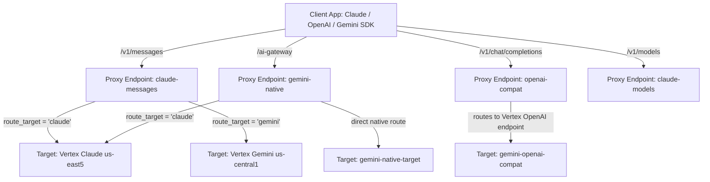

# Apigee LLM Gateway (ai-gateway) API Proxy

This repository contains the Apigee API Proxy implementation for the **AI Gateway**, featuring a **Smart Routing Engine**, universal protocol normalization, enterprise security via **GCP Model Armor**, token rate limiting & quotas via **LLMTokenQuota**, and detailed telemetry analytics.

---

## 🛠 Architecture Overview

The Gateway exposes standard REST endpoints compatible with Anthropic Claude (`/v1/messages`), OpenAI (`/v1/chat/completions`), and native Google Gemini (`/ai-gateway`), while decoupling clients from backend infrastructure.



### 1. Proxy Endpoints
*   **[claude-messages](apiproxy/proxies/claude-messages.xml):** Exposes `/v1/messages`. Accepts Claude-format requests, applies Model Armor, resolves smart routing/fallbacks, and dynamically routes to Anthropic Claude or Google Gemini backends.
*   **[claude-models](apiproxy/proxies/claude-models.xml):** Exposes `/v1/models` and `/v1/models/{id}`. Dynamically serves the active model catalog from propertysets with API Product entitlement filtering.
*   **[gemini-native](apiproxy/proxies/gemini-native.xml):** Exposes `/ai-gateway`. Accepts native Gemini REST API payloads directly, as well as native Vertex AI Anthropic Claude raw predict payloads.
*   **[openai-compat](apiproxy/proxies/openai-compat.xml):** Exposes `/v1/chat/completions`. Accepts standard OpenAI completions payloads and routes them to Vertex AI's OpenAI-compatible multi-region endpoint.

### 2. Target Endpoints
*   **[claude](apiproxy/targets/claude.xml):** Points to Vertex AI Anthropic Claude API (`us-east5`).
*   **[gemini](apiproxy/targets/gemini.xml):** Points to Vertex AI Gemini API (`us-central1`), translating Claude format to Gemini format with full tool calling and streaming support.
*   **[gemini-native-target](apiproxy/targets/gemini-native-target.xml):** Points to native Vertex AI Gemini API.
*   **[gemini-openai-compat](apiproxy/targets/gemini-openai-compat.xml):** Points to Vertex AI's Global/Multi-region OpenAI Compatibility endpoint for Gemini.

---

## ⚡ Smart Routing Capabilities

The gateway supports flexible, policy-driven client routing patterns (fully opt-in and backward-compatible):

### 1. Cascading Fallback Chains (`models: [...]`)
Clients can supply a prioritized array of fallback candidates:
```json
{
  "models": ["claude-3-5-sonnet", "gemini-3.5-flash", "gemini-3.5-flash-lite"],
  "messages": [{ "role": "user", "content": "Hello" }]
}
```
The gateway extracts provider prefixes (`anthropic/`, `google/`, `openai/`), selects the primary candidate, and prepares the fallback target.

### 2. Auto-Router & Cost-Tier Optimization
Clients can request automatic cost-tier optimization:
```json
{
  "plugins": [{ "id": "auto-router", "cost_tier": "low" }],
  "messages": [{ "role": "user", "content": "Summarize this document" }]
}
```
*   `cost_tier: "low"` $\to$ Routes to **Gemini 3.1 Flash-Lite** (`global`)
*   `cost_tier: "medium"` $\to$ Routes to **Gemini 3.5 Flash** (`global`)
*   `cost_tier: "high"` $\to$ Routes to **Gemini 2.5 Pro** (`global`)
*   `cost_tier: "max"` $\to$ Routes to **Claude 4.5 Haiku** (`us-east5`)

Alternatively, pass `model: "gateway/auto"` or `model: "auto"` for default balanced auto-routing.

### 3. LLM as a Judge & Real-time Task Classifier
The gateway features an integrated **LLM as a Judge** service callout ([`SC-LLMJudge.xml`](apiproxy/policies/SC-LLMJudge.xml)) powered by **Gemini 3.1 Flash-Lite** on `locations/global`:
* Evaluates prompt complexity ($1 - 10$) and task taxonomy (`coding`, `reasoning`, `summarization`, `simple_chat`).
* Automatically selects the optimal cost tier and model at runtime without hardcoded client configs.
* Returns evaluation metadata in response headers:
  * `X-Gateway-Judge-Task`: Evaluated task category.
  * `X-Gateway-Judge-Complexity`: Score from $1$ to $10$.
  * `X-Gateway-Judge-Tier`: Recommended cost tier (`low`, `medium`, `high`, `max`).
  * `X-Gateway-Judge-Reasoning`: Brief classification rationale.

**Payload-Driven Triggers (No Custom Headers Required):**
* `{"model": "auto:judge"}`
* `{"model": "gateway/judge"}`
* `{"plugins": [{"id": "auto-router", "judge": true}]}`
* `{"plugins": [{"id": "judge"}]}`

### 4. Legacy Model Aliases & Rewrites
Legacy model requests are dynamically mapped in [`model_locations.properties`](apiproxy/resources/properties/model_locations.properties):
*   `gemini-1.5-flash` $\to$ `gemini-3.5-flash`
*   `gemini-1.5-pro` $\to$ `gemini-2.5-pro`
*   `gemini-3.1-pro` $\to$ `gemini-2.5-pro`
*   `gpt-4o` $\to$ `gemini-2.5-pro`
*   `gpt-4o-mini` $\to$ `gemini-3.1-flash-lite`
*   `claude-3-5-*` $\to$ `claude-haiku-4-5`

### 5. Fast-Path Performance Optimizations
*   **Zero-JSON Parse Fast Path:** Standard single-model requests bypass `JSON.parse` entirely, saving **~3–8 ms** on large payloads.
*   **Convention-Based Target Resolution:** Bypasses multiple JNI variable bridge calls for standard Claude and Gemini models, saving **~1–3 ms**.

---

## 📦 Active Model Catalog

| Model ID | Publisher | Default Region | Tier | Description |
| :--- | :--- | :--- | :--- | :--- |
| `gemini-3.7-flash` | Google | `global` | Fast / Hybrid | Latest Gemini 3.7 generation (GA) |
| `gemini-3.5-flash` | Google | `global` | Balanced / Medium | High-speed, high-efficiency Flash model (GA) |
| `gemini-3.1-flash-lite` | Google | `global` | Low Cost | Budget, ultra-low-latency Flash-Lite model (GA) |
| `gemini-2.5-pro` | Google | `global` | High / Reasoning | Advanced reasoning and complex tasks (GA) |
| `gemini-2.5-flash` | Google | `global` | Medium | General-purpose Flash model (GA) |
| `claude-haiku-4-5` | Anthropic | `us-east5` | Max / Fast | Claude 4.5 generation |

---

## 🔒 Security (GCP Model Armor Sanitization)

Prompt and response sanitization are enforced at message flow boundaries.

*   **Request Sanitization:**
    *   **Claude/OpenAI Routes:** Prompt is extracted via [JS-extract-prompt](apiproxy/policies/JS-extract-prompt.xml) and evaluated by [SUP-SanitizeUserPrompt](apiproxy/policies/SUP-SanitizeUserPrompt.xml).
    *   **Gemini Native Route:** Text segments are evaluated by [SUP-SanitizeUserPromptGemini](apiproxy/policies/SUP-SanitizeUserPromptGemini.xml).
*   **Response Sanitization:** Model completions are evaluated by [SMR-SanitizeModelResponse](apiproxy/policies/SMR-SanitizeModelResponse.xml).
*   **Custom Error Injection:** Violations trigger [JS-inject-deidentified-finding](apiproxy/resources/jsc/inject_deidentified_finding.js) and [AM-CustomError](apiproxy/policies/AM-CustomError.xml).

---

## 📊 Quota, Token Management & Analytics

Token usage is tracked using Apigee's **LLMTokenQuota** policy in rolling window mode (`LTQ-EnforceOnly` & `LTQ-CountOnly`).

### Telemetry Data Collectors

The gateway captures both the **effective routed model** and the **original consumer intent** on every transaction via [`DC-CaptureTokenCountsNonStreaming.xml`](apiproxy/policies/DC-CaptureTokenCountsNonStreaming.xml) and [`DC-CaptureTokenCountsStreaming.xml`](apiproxy/policies/DC-CaptureTokenCountsStreaming.xml):

| Data Collector | Collected Variable | Description |
| :--- | :--- | :--- |
| `dc_model` | `model` | The actual model that executed the completion (e.g. `gemini-3.1-flash-lite`). |
| `dc_requested_model` | `requested_model` | Original consumer request (e.g. `auto:judge`, `models:[...]`, `gpt-4o`). |
| `dc_total_token_count` | `usage_total_tokens` | Total input + output tokens billed. |
| `dc_prompt_token_count` | `prompt_tokens` / `usage_prompt_tokens` | Prompt input tokens. |
| `dc_completion_token_count` | `completion_tokens` / `usage_completion_tokens` | Completion output tokens. |

### Apigee Custom Analytics Report: LLM Judge & Cost Optimization

A dedicated Custom Report can be configured in your Apigee organization to track the token savings and model routing distribution enabled by the LLM Judge:

* **Report Name:** `LLM Judge Smart Routing & Cost Optimization`
* **Metrics:** `sum(dc_total_token_count)`, `sum(message_count)`
* **Dimensions:** `apiproxy`, `dc_requested_model`, `dc_model`

To query or inspect the report using `apigeecli`:
```bash
~/.apigeecli/bin/apigeecli reports get \
  -n <report-id> \
  -o your-org \
  --default-token
```

### Observability Response Headers
Every response includes gateway metadata headers:
*   `X-Gateway-Requested-Model`: Raw requested model or optimization selector.
*   `X-Gateway-Routed-Model`: Resolved model that served the response.
*   `X-Gateway-Cost-Tier`: Applied cost tier (when auto-router/judge is invoked).
*   `X-Gateway-Fallback-Model`: Configured secondary model.
*   `X-Gateway-Judge-Task`: Task category determined by LLM Judge.
*   `X-Gateway-Judge-Complexity`: Complexity score ($1-10$).
*   `X-Gateway-Judge-Tier`: Recommended tier by Judge.

---

## 🧪 Verification & Test Suites

All test scripts execute up to 15 transactions per run:

### LLM as a Judge Suites
*   **[test-judge.sh](test-judge.sh):** 15 test cases validating LLM as a Judge across all complexity levels, task categories, multi-protocols (Claude, Gemini, OpenAI), and streaming.
*   **[test-judge-prompts.sh](test-judge-prompts.sh):** 15 crafty benchmark prompt scenarios specifically evaluating `{"model": "auto:judge"}` and `{"model": "gateway/judge"}`.

### Smart Routing & Streaming Suites
*   **[test-smart-routing.sh](test-smart-routing.sh):** 15 test cases validating Claude, Gemini 3.x, fallback chains, auto-router cost tiers, aliases, tool calling, and multimodal vision.
*   **[test-smart-stream.sh](test-smart-stream.sh):** 15 streaming test cases validating bidirectional SSE chunk translation, streaming tool calls, and EventFlow quota deduction.
*   **[test-claude-models.sh](test-claude-models.sh):** Validates `/v1/models` dynamic catalog discovery and single-model lookups.

### Baseline Route Suites
*   **[test-claude.sh](test-claude.sh):** Tests standard Claude non-streaming route with Model Armor security filters.
*   **[test-claude-stream.sh](test-claude-stream.sh):** Tests Claude route streaming (`stream: true`).
*   **[test-gemini-native.sh](test-gemini-native.sh):** Tests native Gemini route (`/ai-gateway`).
*   **[test-openai-compat.sh](test-openai-compat.sh):** Tests OpenAI completions compatibility (`/v1/chat/completions`).

---

## 🚀 Deployment Instructions (apigeecli)

### 1. Create Data Collectors in Apigee

```bash
# Prompt Token Count Collector
~/.apigeecli/bin/apigeecli datacollectors create -o your-org -n dc_prompt_token_count -p INTEGER --default-token

# Completion Token Count Collector
~/.apigeecli/bin/apigeecli datacollectors create -o your-org -n dc_completion_token_count -p INTEGER --default-token

# Total Token Count Collector
~/.apigeecli/bin/apigeecli datacollectors create -o your-org -n dc_total_token_count -p INTEGER --default-token

# Routed Model Name Collector
~/.apigeecli/bin/apigeecli datacollectors create -o your-org -n dc_model -p STRING --default-token

# Requested Model / Intent Collector
~/.apigeecli/bin/apigeecli datacollectors create -o your-org -n dc_requested_model -p STRING --default-token
```

### 2. Deploy Proxy Bundle

```bash
~/.apigeecli/bin/apigeecli apis create bundle \
  -n ai-gateway \
  -o your-org \
  -e your-env \
  -f ./apiproxy \
  -s your-service-account@your-project-id.iam.gserviceaccount.com \
  --ovr \
  --wait \
  --default-token
```

