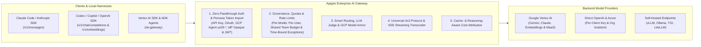

#  Apigee Enterprise AI Gateway (`ai-gateway`)

[](https://ra2085.github.io/ai-gw-sample/)
[](LICENSE)

A turnkey, production-ready **Enterprise AI Gateway** on Google Cloud Apigee. Start with a **15-line YAML file** in 5 minutes, and progressively enable **Persona-Based Enterprise Authentication (Okta / Ping / Entra / GCP Agent Identity)**, **Universal Protocol Transcoding (`/v1/messages`, `/v1/chat/completions`, `/v1/embeddings`, `/ai-gateway`)**, **Per-Model & Team Token Quotas**, **Cache-Aware Cost Attribution**, **Smart Routing**, and **GCP Model Armor Security**.

---

## Documentation Site

Full guides, decision matrices, architecture diagrams, and `values.yaml` references are available at:

**[https://ra2085.github.io/ai-gw-sample/](https://ra2085.github.io/ai-gw-sample/)**

---

## Progressive Adoption: Start Simple, Layer Controls as You Grow

You do not need to configure everything on Day 1. Every enterprise capability is modular and controlled via `values.yaml`:

| Adoption Stage | What You Configure | Key Capabilities Unlocked | Guide |
| :--- | :--- | :--- | :--- |
| **Stage 1: 5-Minute Quickstart** | 15-line `values.quickstart.yaml` | Repoint Claude Code, Codex, OpenAI SDK, or Vertex ADK to Apigee with zero code changes and full SSE streaming. | **[5-Minute Quickstart](docs/getting-started/quickstart-template.md)** |
| **Stage 2: Multi-Model & Multi-Host** | Add entries under `models:` | Route to Vertex Gemini & Claude, Vertex Model Garden MaaS (`meta/`, `mistralai/`), Direct OpenAI (`api.openai.com`), Azure, vLLM/Ollama, and `/v1/embeddings`. | **[Models & Custom URLs](docs/template-guide/custom-urls.md)** |
| **Stage 3: API Products & Persona Auth** | Configure `features.auth` | Govern **10,000+ users and agents with just 3–5 Apigee API Products** (zero per-user provisioning in Apigee). Maps API Keys, OAuth, GCP Agent Identity (`ya29.*`), and Corporate SSO (Okta/Ping/Entra) to Persona API Products while enforcing isolated per-user quota buckets in `<1ms`. | **[API Products & Persona Auth](docs/architecture/security.md)** |
| **Stage 4: Quotas, Budgets & Cost** | Configure `features.quotas`, `rate_limits`, `monetization` | Enforce Per-Model LLM Operation quotas, 4h/7d sliding windows, Shared Team Budgets, Time-Bound Individual Exceptions, Burst/Concurrency limits, and Cache/Reasoning-aware USD billing. | **[Quotas, Limits & Cost](docs/architecture/monetization.md)** |
| **Stage 5: Smart Routing & Safety** | Enable `llm_judge` & `model_armor` | Dynamically classify prompt complexity with Gemini 2.5 Flash-Lite and sanitize prompts/responses with GCP Model Armor. | **[Smart Routing](docs/architecture/routing.md)** |

---

## Architecture Overview


```mermaid
graph LR
    subgraph Clients["Clients & Local Harnesses"]
        C1["Claude Code / Anthropic SDK<br/>(/v1/messages)"]
        C2["Codex / Copilot / OpenAI SDK<br/>(/v1/chat/completions & /v1/embeddings)"]
        C3["Vertex AI SDK & ADK Agents<br/>(/ai-gateway)"]
    end

    subgraph Gateway["Apigee Enterprise AI Gateway"]
        direction TB
        G1["1. Zero-Passthrough Auth & Persona Token Import<br/>(API Key, OAuth, GCP Agent ya29.*, IdP Opaque & JWT)"]
        G2["2. Governance, Quotas & Rate Limits<br/>(Per-Model, Per-User, Shared Team Budget & Time-Bound Exceptions)"]
        G3["3. Smart Routing, LLM Judge & GCP Model Armor"]
        G4["4. Universal 4x3 Protocol & SSE Streaming Transcoder"]
        G5["5. Cache- & Reasoning-Aware Cost Attribution"]
    end

    subgraph Providers["Backend Model Providers"]
        P1["Google Vertex AI<br/>(Gemini, Claude, Embeddings & MaaS)"]
        P2["Direct OpenAI & Azure<br/>(Per-Client Key & Org Isolation)"]
        P3["Self-Hosted Endpoints<br/>(vLLM, Ollama, TGI, LiteLLM)"]
    end

    Clients --> Gateway
    Gateway --> Providers
```

---

## Quickstart (5 Minutes)

> **Prerequisites:**
> 1. Install [`apigee-go-gen`](docs/getting-started/installation.md#install-apigee-go-gen-template-generator) and [`apigeecli`](docs/getting-started/installation.md#install-apigeecli-deployment-cli).
> 2. Create the required telemetry Data Collectors in your Apigee org (one-time setup in the [Installation Guide](docs/getting-started/installation.md#5-create-data-collectors-required-one-time-organization-setup)).
> 3. Have a Google Cloud Service Account with `roles/aiplatform.user` for Vertex AI IAM authentication (`-s "$SERVICE_ACCOUNT"`).

### 1. Define Your Gateway (`values.quickstart.yaml`)

```yaml
gateway:
  name: "ai-gateway"
  project_id: "your-gcp-project-id"

models:
  - name: "gemini-2.5-flash"
    displayName: "Gemini 2.5 Flash"
    publisher: "google"
    format: "gemini"
    region: "global"
    is_default: true

  - name: "claude-haiku-4-5"
    displayName: "Claude 4.5 Haiku"
    publisher: "anthropic"
    format: "anthropic"
    region: "us-east5"

  # Optional: Self-Hosted or External OpenAI-Compatible Model
  - name: "my-vllm-model"
    displayName: "Llama 3 (Self-Hosted)"
    format: "openai"
    custom_url: "https://vllm.internal.corp/v1/chat/completions"
```

### 2. Render & Deploy

```bash
# 1. Compile the Apigee proxy bundle from YAML
apigee-go-gen render apiproxy \
    --template ./templates/ai-gateway/apiproxy.yaml \
    --values ./templates/ai-gateway/values.quickstart.yaml \
    --output ./out/ai-gateway.zip

# 2. Validate Locally (Runs all 8 template & runtime test suites)
./tests/scripts/test_template.sh && ./tests/scripts/test_quickstart.sh

# 3. Deploy to Apigee X / Hybrid
apigeecli apis create bundle \
    --proxy-zip ./out/ai-gateway.zip \
    --name ai-gateway \
    --org "$PROJECT_ID" \
    --env "$APIGEE_ENV" \
    -s "$SERVICE_ACCOUNT" \
    --ovr \
    --wait \
    --default-token
```

---

## Documentation Map

| Category | Guide | What You Will Learn |
| :--- | :--- | :--- |
| **1. Getting Started** | **[5-Minute Quickstart](docs/getting-started/quickstart-template.md)** | Render and deploy a working gateway from a minimal 15-line YAML file. |
| | **[Installation & Setup](docs/getting-started/installation.md)** | Install `apigee-go-gen` & `apigeecli`, configure IAM, and register Data Collectors. |
| | **[Choose Your Workflow](docs/getting-started/choose-workflow.md)** | When to use the declarative YAML template (`templates/ai-gateway/`) vs. raw XML (`apiproxy/`). |
| **2. Configuration & Models** | **[`values.yaml` Reference](docs/template-guide/configuration.md)** | Complete schema reference with defaults for every gateway option. |
| | **[Models, Providers & Custom URLs](docs/template-guide/custom-urls.md)** | Configure Vertex AI, Model Garden MaaS, Direct OpenAI, Azure, vLLM, and `/v1/embeddings`. |
| | **[Feature Toggles & Decision Matrix](docs/template-guide/feature-flags.md)** | Which optional features to enable and what policies they compile into the bundle. |
| **3. Enterprise Governance** | **[Authentication, Persona Tiers & Security](docs/architecture/security.md)** | 4-Option Auth (API Key, OAuth, Agent `ya29.*`, IdP Opaque/JWT Token Import), Persona-to-Product mapping, and GCP Model Armor. |
| | **[Quotas, Rate Limits, Team Budgets & Cost](docs/architecture/monetization.md)** | Per-Model LLM Quotas, 4h/7d Windows, Shared Team Budgets, Time-Bound Exceptions, Burst/Concurrency Limits, and Cache-Aware Billing. |
| | **[Smart Routing & LLM Judge](docs/architecture/routing.md)** | Cost tiers, model aliases, fallback chains, and real-time complexity classification. |
| **4. Deep Dive** | **[Protocol Normalization & Embeddings](docs/architecture/protocols.md)** | How `/v1/messages`, `/v1/chat/completions`, `/v1/embeddings`, and `/ai-gateway` transcode across providers. |
| | **[Bundle Structure & Execution Flow](docs/proxy-deep-dive/bundle-structure.md)** | End-to-end PreFlow, Target, EventFlow, and PostFlow execution order. |
| | **[Policies & JS Callouts Reference](docs/proxy-deep-dive/policies-reference.md)** | Complete catalog of all XML policies and JavaScript callouts. |
| **5. Operations** | **[Telemetry, Headers & Dashboards](docs/operations/telemetry.md)** | Response headers (`X-Gateway-*`, `X-RateLimit-*`), Data Collectors, and Looker Studio cost reporting. |
