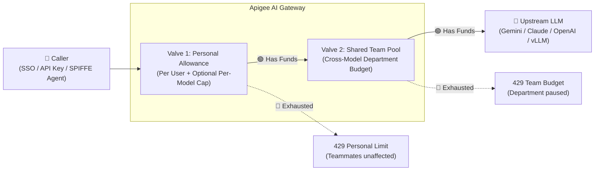

# Quotas, Budgets & Cost Control

Once you have organized your callers into **AI Products**, you can enforce personal allowances, shared department budgets, temporary exceptions, and traffic limits—using a single declarative block in `values.yaml`.

---

## 1. How It Works: The Two-Valve Model

Regardless of how a caller authenticates (**API Key**, **Native OAuth**, **Okta/Entra SSO**, **Google Cloud Agent Identity / SPIFFE**, or **IAM Service Account**), the gateway resolves the caller's **User/Agent ID**, **Persona**, and **Department/Team**, and passes every request through at most **two independent valves**:



* **Valve 1 — Personal Allowance (Always Active):** Gives each individual engineer or agent their own isolated rolling budget (in **Tokens** or **$USD**), plus optional stricter caps on expensive frontier models (like `claude-opus-4-6`). One runaway script can never drain a teammate's personal quota.
* **Valve 2 — Shared Team Pool (Opt-In):** Caps total spend across an entire department (e.g., `eng-ml`, `sales`) across **all models combined**. You can even mix units (for example, a **4-hour Token limit per user** + a **30-day $USD budget per team**).
* **Auto-Expiring Exceptions:** Temporarily boost an individual's allowance, top up a team's shared pool, or grant an emergency bypass (`bypass_team_budget: true`) until an `expires_at` timestamp—without creating separate API Products or remembering to roll changes back.

---

## 2. Copy-Paste Recipes

Click any tab below for the exact `values.yaml` snippet to copy into your configuration:

=== "Recipe 1: Personal Allowance & Per-Model Caps"
    **Goal:** Give every developer **$15.00 / day** (or `500,000 tokens / day`), while capping expensive frontier models (`claude-sonnet-4-6`) at **$5.00 / day** per user.

    ```yaml
    features:
      monetization:
        enabled: true
        enforce_apigee_wallet: false              # Use zero-admin Virtual USD Spend Wallets
      quotas:
        enabled: true
      auth:
        personas:
          developer:
            models: ["*"]
            quota:
              # Use limit_usd / per_model_usd for $USD, OR limit / per_model for raw tokens:
              limit_usd: 15.00                    # $15.00 USD / day per individual engineer
              interval: 1
              time_unit: "day"
              per_model_usd:
                claude-sonnet-4-6: 5.00           # Max $5.00 USD / day on Claude Sonnet 4.6
    ```

=== "Recipe 2: Shared Team Pool + Personal Guardrails"
    **Goal:** Give each department (e.g., `eng-ml`, `platform`) a shared **$250.00 / 30-day** budget across all models, while keeping a **$15.00 / day** personal limit per engineer so one user cannot accidentally consume the entire department's monthly pool in an afternoon.

    ```yaml
    features:
      quotas:
        enabled: true
        secondary_window:
          enabled: true                           # Turns on Valve 2 (Shared Team Pool)
      auth:
        personas:
          developer:
            models: ["*"]
            quota:                                # Valve 1: Per-User Daily Cap
              limit_usd: 15.00
              interval: 1
              time_unit: "day"
            team_budget:                          # Valve 2: Shared Department Monthly Pool
              limit_usd: 250.00                   # Shared by everyone in the same department
              interval: 30
              time_unit: "day"
    ```

=== "Recipe 3: Temporary Exceptions & Emergency Bypass"
    **Goal:** Handle real-world operational exceptions in a few lines of YAML—with automatic expiration (`expires_at`) so temporary boosts never become permanent leaks:

    ```yaml
    features:
      auth:
        exceptions:
          # Case A: Personal Boost (Alice gets $50/day for a benchmark sprint; still draws from her team's pool)
          - match: ["alice@corp.example.com"]
            quota_limit_usd: 50.00
            expires_at: "2026-12-31T17:00:00Z"
            models: ["*"]

          # Case B: Emergency On-Call Bypass (Bob gets $100/day AND keeps working even if his team's pool is $0)
          - match: ["bob@corp.example.com"]
            quota_limit_usd: 100.00
            bypass_team_budget: true              # Isolates Bob from an exhausted team budget
            expires_at: "2026-12-31T17:00:00Z"

          # Case C: Department Top-Up (Raise team 'ml-research' shared pool to $1,000 until quarter-end)
          - match: ["team:ml-research"]
            team_budget_limit_usd: 1000.00
            expires_at: "2026-12-31T17:00:00Z"
    ```

    #### How Valve 1 (Individual), Valve 2 (Team Pool), and Exceptions Interact

    | Valve 2: Team Pool | Valve 1: Personal Cap | Caller Status | Outcome |
    | :--- | :--- | :--- | :--- |
    | 🟢 **Has Funds** | 🟢 **Has Funds** | **Standard** | **Approved (`200`).** Deducts from both the user's personal meter and their department's shared pool. |
    | 🟢 **Has Funds** | 🔴 **Exhausted** | **Standard** | **Blocked (`429`).** Only this user is rate-limited (`per_model_quota` / `token_quota_primary`); teammates keep working. |
    | 🔴 **Exhausted** | 🟢 **Has Funds** | **Standard** | **Blocked (`429`).** Department pool is empty (`team_budget_quota`); all standard users on that team are paused. |
    | 🟢 **Has Funds** | 🔴 **Exhausted** | **Individual Exception** | **Approved (`200`).** Exception raises the user's personal cap while still deducting from the remaining team pool. |
    | 🔴 **Exhausted** | 🟢 / 🔴 *Any* | **Individual Exception** | **Blocked (`429`) by default** (team pool is empty). **Approved (`200`)** if you top up the team (`Case C`) **or** set `bypass_team_budget: true` (`Case B`). |

=== "Recipe 4: Burst & Stream Concurrency Limits"
    **Goal:** Protect upstream LLM capacity from sudden request spikes (`burst`) or runaway loops opening dozens of simultaneous SSE streams (`concurrency`):

    ```yaml
    features:
      rate_limits:
        burst:
          enabled: true
          rate: "600pm"        # Global fallback: 600 requests/minute per user
        concurrency:
          enabled: true
          limit: 20            # Global fallback: 20 simultaneous open SSE streams per user
          ttl_minutes: 1       # Auto-releases slot after 1 min if a client disconnects mid-stream
      auth:
        personas:
          agent:
            rate_limits:
              burst: "1200pm"  # Higher spike limit for autonomous agents
              concurrency: 50
    ```

??? info "Under the Hood: How Apigee Isolates Counters Across All Auth Methods"
    You never have to configure Apigee quota policies manually—`JS-resolve-model-location` normalizes identity claims across all 4 authentication options (**API Key**, **Apigee OAuth**, **GCP SPIFFE / Service Accounts**, and **IdP JWT / Opaque Tokens**) into three strictly isolated `<LLMTokenQuota>` counter namespaces:

    | Counter Pair | `SharedName` | `<Identifier>` | `<LLMModelSource>` | Scope & Purpose |
    | :--- | :--- | :--- | :--- | :--- |
    | **`LTQ-EnforceOnly` / `LTQ-CountOnly`** | `llm-token-counter` | `rate_limit_client_id` *(User email, SPIFFE principal, or App ID)* | `{model}` | **Valve 1 (Per-User & Per-Model):** Matches concrete model entries in the API Product's `llmOperationGroup` and enforces `primary_quota_limit` (`tokens` or `micro-USD`). |
    | **`LTQ-SecondaryEnforceOnly` / `LTQ-SecondaryCountOnly`** | `llm-token-counter-secondary` | `secondary_quota_identifier` *(`team:<dept>` or personal ID when `bypass_team_budget: true`)* | `{secondary_quota_scope}` *(`team` or `user`)* | **Valve 2 (Cross-Model Team Pool / 2nd Window):** Aggregates spend or tokens across all models without colliding with per-model API Product operations. |
    | **`LTQ-CircuitBreakerCheck` / `LTQ-CircuitBreakerCount`** | `llm-circuit-breaker` | `primary_model` / `tried_primary_model` | `{circuit_breaker_checked}` | **Failover Error Budget:** Tracks upstream `429`/`5xx` errors per primary model in a rolling window to trip the circuit `OPEN`. |

    * **Micro-USD Precision without Apigee Developer Onboarding:** In USD mode (`limit_usd` / `team_budget.limit_usd`), the gateway converts dollar limits into integer **micro-dollars** (`$1.00 = 1,000,000` micro-USD) and deducts `tx_cost_micro_usd` on every response (including SSE streams)—giving every SSO user and SPIFFE agent an isolated USD wallet without registering individual Apigee Developer entities.
    * **Syncing API Product Quotas:** Running `./scripts/sync-personas.sh` automatically provisions each persona's API Product and expands `models` + `per_model` / `per_model_usd` into Apigee X's `llmOperationGroup.operationConfigs`.

---

## 3. Invoice-Accurate Cost Attribution

Modern LLMs bill differently for **standard input tokens**, **cached prompt reads**, **cache creation writes**, and **internal reasoning/thinking tokens**.

When `features.monetization.enabled: true` is set, the gateway performs **Invoice-Accurate Cost Attribution** on every request (both non-streaming and streaming) using the exact rates declared on each model in `values.yaml`—with no hardcoded provider multipliers:

```yaml
models:
  - name: "claude-sonnet-4-6"
    publisher: "anthropic"
    format: "anthropic"
    region: "global"              # Global base pricing (use 1.1x rates for regional endpoints like "us-east5")
    pricing:
      input_rate: 3.000           # $3.00 per 1M uncached input tokens ($3.30 regional)
      output_rate: 15.000         # $15.00 per 1M output & reasoning tokens ($16.50 regional)
      cache_read_rate: 0.300      # $0.30 per 1M cached prompt read tokens (0.10x)
      cache_write_rate: 3.750     # $3.75 per 1M 5-minute cache write tokens (1.25x)
      markup: 1.0                 # Optional markup multiplier
```

| Model Family / Provider | `input_rate` & `output_rate` | `cache_read_rate` | `cache_write_rate` | Why |
| :--- | :---: | :---: | :---: | :--- |
| **Google Gemini (`3.x`)** | Required | **Recommended** *(0.10x of `input_rate`)* | Not needed | Gemini bills cached prompt hits at `cache_read_rate`; cache storage is billed by Vertex AI per hour out-of-band rather than per-request write tokens. |
| **Anthropic Claude (`4.5` / `4.6`)** | Required | **Recommended** *(0.10x of `input_rate`)* | **Recommended** *(1.25x of `input_rate`)* | Claude returns both `cache_read_input_tokens` and `cache_creation_input_tokens` on every response. |
| **OpenAI (`gpt-5.4`, `gpt-5.4-mini`)** | Required | **Recommended** *(0.10x of `input_rate`)* | Not needed | OpenAI automatic prompt caching bills `cached_tokens` at `cache_read_rate` with no cache write surcharge. |
| **Vertex MaaS (Llama, Mistral), Embeddings, & Self-Hosted (`vLLM`)** | Required | Not needed | Not needed | These endpoints do not bill separate cached token rates; if omitted, any reported cached tokens default to `input_rate`. |

* **Chargeback & Showback Analytics:** Every transaction records its exact USD cost (`dc_tx_cost_usd` and `X-Gateway-Total-Cost-Micro-USD`), token breakdown, model (`dc_model`), persona (`dc_identity_persona`), team (`dc_identity_team`), and user (`dc_identity_user_id`) in Apigee Analytics.
* **Two Wallet Enforcement Modes:**
  1. **Virtual USD Spend Wallets (`limit_usd` + `enforce_apigee_wallet: false`):** Recommended when onboarding users via SSO/JWT/SPIFFE onto shared Persona AI Products without creating an Apigee Developer entity per user. Enforces per-user, per-model, and shared team USD spend caps in micro-dollars (`$1.00 = 1,000,000` micro-USD).
  2. **Native Apigee Monetization Wallets (`enforce_apigee_wallet: true`):** Uses `MLC-EnforceMonetizationLimits` to verify prepaid/postpaid balances on the Apigee Developer entity owning the Developer App.
