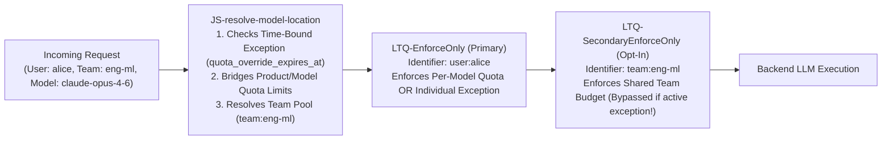

# 💳 Quotas, Rate Limits, Team Budgets & Monetization

Controlling LLM spend and protecting backend capacity requires more than a single static rate limit. However, configuring multi-tier governance in Apigee shouldn't require dozens of redundant policies.

The AI Gateway unifies **6 layers of token & traffic governance** and a **Cache- & Reasoning-Aware Cost Engine** using just **2 Quota policy pairs** (`LTQ-EnforceOnly`/`LTQ-CountOnly` and opt-in `LTQ-SecondaryEnforceOnly`/`LTQ-SecondaryCountOnly`) plus opt-in Burst/Concurrency policies.

---

## 1. Decision Matrix: Which Quota or Rate Limit Do You Need?

| Governance Goal | Mechanism Used | Where You Configure It | Diagnostic `429` `constraint` |
| :--- | :--- | :--- | :--- |
| **1. Standard Rolling Token Quota** *(e.g., 500k tokens per 4 hours per user)* | Primary `LLMTokenQuota` (`LTQ-EnforceOnly` / `LTQ-CountOnly`) | Apigee **API Product** standard LLM Quota settings | `token_quota_primary` |
| **2. Per-Model Token Quota** *(e.g., cap `claude-opus-4-6` at 50k tokens; leave `gemini-2.5-flash` unlimited)* | Primary `LLMTokenQuota` with `<LLMModelSource>{model}</LLMModelSource>` | Apigee **API Product** *LLM Operations* per-model config | `per_model_quota` |
| **3. Dual Rolling Windows** *(e.g., 4-hour burst window + 7-day weekly cap)* | Secondary `Quota` (`LTQ-SecondaryEnforceOnly` / `CountOnly`) | `features.quotas.secondary_window.enabled: true` + Product attributes (`secondary_quota_*`) | `token_quota_secondary` |
| **4. Shared Team Token Budget** *(e.g., all engineers in `eng-ml` share 10M tokens/week)* | Secondary `Quota` keyed by `secondary_quota_identifier = "team:<dept>"` | Developer App / Product attribute `team_quota_limit` (or `X-Gateway-Team-Quota-Limit` header) | `team_budget_quota` |
| **5. Time-Bound Individual Exception** *(e.g., grant Alice 5M tokens until Friday 5pm UTC)* | Dynamic override in `resolve_model_location.js` + auto-expiry check | Developer App / Developer attributes `quota_override` + `quota_override_expires_at` | `individual_exception_quota` |
| **6. Burst & Stream Concurrency** *(e.g., max 10 req/sec & max 20 open SSE streams)* | Opt-in `SA-BurstRateLimit` (`SpikeArrest`) & `Q-ConcurrencyLimit` (`Quota` + `ResetQuota`) | `features.rate_limits.burst` & `features.rate_limits.concurrency` | `burst_rate_limit` / `concurrency_limit` |

---

## 2. How Multi-Tier Token Quotas Work Together

### A. Per-Model Quotas Without Redundant Policies
When you configure **LLM Operation Quotas** on an Apigee API Product for specific expensive models (such as `claude-opus-4-6` or `gpt-5.4`), `LTQ-EnforceOnly` inspects `<LLMModelSource>{model}</LLMModelSource>` and `<UseQuotaConfigInAPIProduct stepName="VA-ApiKey"/>`:
* **Quoted Models:** Enforces the exact per-model token limit for that client (`rate_limit_client_id`).
* **Unquoted Models:** If a client calls a model that has no specific operation quota on the API Product (and no global fallback limit), `quota_limit_primary` is absent and `LTQ-EnforceOnly` is conditionally skipped—allowing free/fast models like `gemini-2.5-flash-lite` to run unthrottled!
* **Works Across All 4 Auth Options:** Even for OAuth and Persona-imported tokens (`OA-VerifyAccessToken`), `resolve_model_location.js` bridges `apiproduct.developer.llmQuota.{limit,interval,timeunit}` into the `verifyapikey.VA-ApiKey.*` namespace so a single `LTQ-EnforceOnly` policy handles API Keys, OAuth, Agent Identity, and IdP Tokens.

### B. Shared Team Budgets (`team:<identity_team>`)
When `features.quotas.secondary_window.enabled: true` is set and a team budget is configured (`team_quota_limit`, `team_quota_interval`, `team_quota_unit` on the API Product/App or via `X-Gateway-Team-Quota-Limit`):
* `resolve_model_location.js` sets `secondary_quota_identifier = "team:" + identity_team` (e.g., `team:eng-ml`) and `quota_tier_mode = "team_budget"`.
* Every member of `eng-ml` decrements from the same shared `team:eng-ml` counter in `LTQ-SecondaryCountOnly`, while still maintaining their individual per-user primary quota in `LTQ-CountOnly`.

### C. Time-Bound Individual Exceptions (`quota_override_expires_at`)
Need to grant an engineer a temporary quota boost for a production release or hackathon without permanently editing an API Product?
Set two custom attributes on the Developer or Developer App (or pass via headers `X-Gateway-Quota-Override` and `X-Gateway-Quota-Override-Expires-At`):
* `quota_override`: `"5000000"` (5M tokens)
* `quota_override_expires_at`: `"2026-12-31T23:59:59Z"` (ISO-8601 timestamp or epoch ms)

**What happens at runtime:**
1. **While Active (`now < expires_at`):** `resolve_model_location.js` overrides the user's primary token limit to `5,000,000`, sets `individual_exception_active = "true"`, and **automatically bypasses the shared Team Budget (`LTQ-SecondaryEnforceOnly`)** so the user's approved exception is not blocked by a depleted team pool.
2. **After Expiry (`now >= expires_at`):** The gateway automatically ignores the expired override (`quota_override_expired = "true"`) and seamlessly reverts the user back to their standard Persona/Product quota and Team Budget—zero manual cleanup required!

---

## 3. Cache- & Reasoning-Aware Token Monetization

Modern frontier models (Gemini 2.5, Claude 4.5/4.6, OpenAI GPT-5.4/o3) bill differently for **uncached input tokens**, **cached prompt reads**, **cache creation writes**, and **internal reasoning/thinking tokens**.

### 1. Pre-Flight Credit Enforcement
Before dispatching requests to Vertex AI or OpenAI, `MLC-EnforceMonetizationLimits` evaluates the developer's prepaid wallet balance and immediately rejects depleted accounts.

### 2. Multi-Bucket Micro-Cost Formula (`calculate_monetization_cost.js`)
Executed in `PostFlow` (non-streaming) and `EventFlow` (streaming SSE trailer), `JS-calculate-monetization-cost` extracts all 5 token buckets across Gemini, Anthropic, and OpenAI formats:

* **Uncached Prompt Tokens (`usage_uncached_prompt_tokens`):** Billed at `input_rate_per_m`
* **Cache Read Tokens (`usage_cache_read_tokens`):** Billed at `cache_read_rate_per_m` (defaults to `0.10x` for Anthropic/Gemini or `0.25x`/`0.50x` for OpenAI if not explicitly set in `monetization_rates.properties`)
* **Cache Write Tokens (`usage_cache_write_tokens`):** Billed at `cache_write_rate_per_m` (defaults to `1.25x` input rate for Anthropic `cache_creation_input_tokens`)
* **Completion + Reasoning/Thinking Tokens (`usage_completion_tokens + usage_Internal_thinking_tokens`):** Billed at `output_rate_per_m`

$$
\text{Total Cost (USD)} = \left[ \frac{\text{Uncached In} \times R_{\text{in}} + \text{Cache Read} \times R_{\text{read}} + \text{Cache Write} \times R_{\text{write}} + (\text{Out} + \text{Thinking}) \times R_{\text{out}}}{10^6} \right] \times \text{Markup}
$$

### 3. Real-Time Observability & Wallet Deduction
Every response emits detailed cost and cache breakdown headers (`X-Gateway-Cache-Read-Tokens`, `X-Gateway-Reasoning-Tokens`, `X-Gateway-Prompt-Cost-USD`, `X-Gateway-Completion-Cost-USD`, `X-Gateway-Total-Cost-USD`) and captures `dc_tx_cost_usd` into Apigee Analytics and Monetization.

