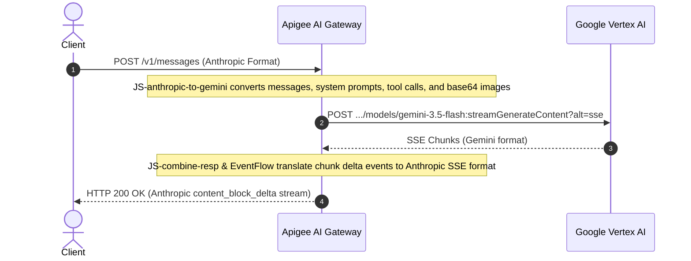

# Protocol Normalization & Transcoding

The AI Gateway decouples client application SDKs from backend model implementations through real-time bidirectional translation.

---

## 1. Supported Ingress Endpoints & 3×3 Transcoding Matrix

| Ingress Client Endpoint | Target Backend: **OpenAI** *(vLLM / Azure / DeepSeek)* | Target Backend: **Anthropic** *(Claude API / Vertex)* | Target Backend: **Gemini** *(Google Vertex AI)* |
| :--- | :---: | :---: | :---: |
| **Claude SDK** `POST /v1/messages` | ✅ **Full Transcoding** *(Claude &rarr; OpenAI schema + SSE)* | ✅ **Native Passthrough** *(Direct routing + auth injection)* | ✅ **Full Transcoding** *(Claude &rarr; Gemini schema + SSE)* |
| **OpenAI SDK** `POST /v1/chat/completions` | ✅ **Native Passthrough** *(Direct routing + auth injection)* | ✅ **Full Transcoding** *(OpenAI &rarr; Claude schema + SSE)* | ✅ **Full Transcoding** *(OpenAI &rarr; Gemini schema + SSE)* |
| **Vertex AI SDK** `POST /ai-gateway` | ℹ️ **Via OpenAI Endpoint** *(Clients use `/v1/chat/completions`)* | ✅ **Native Passthrough** *(Direct to Claude `:rawPredict`)* | ✅ **Native Passthrough** *(Direct to Gemini `:generateContent`)* |
| **Catalog Discovery** `GET /v1/models` | ✅ **OpenAI Format** | ✅ **Anthropic Format** | ✅ **Dynamic Catalog** |

---

## 2. Request Translation Pipeline

---

## 3. Streaming Support (SSE Transcoding)

Both streaming (`stream: true`) and non-streaming requests are supported across all protocols:
* **Anthropic SSE:** Translates `message_start`, `content_block_start`, `content_block_delta`, `message_delta`, and `message_stop`.
* **Gemini SSE:** Parses chunk candidates and normalizes usage metadata from stream trailers.
* **Token Accumulation:** Token consumption is aggregated in real time in `EventFlow` to accurately decrement quotas and calculate micro-costs on completion.

---

## 4. Publisher vs. Wire Protocol Decoupling

The gateway strictly separates **Publishers** (who hosts or creates the model: Meta, DeepSeek, Mistral, Azure, Google, Anthropic, internal vLLM) from **Wire Protocols** (the HTTP/JSON format: `openai`, `anthropic`, `gemini`).

### Publisher vs. Protocol Mapping Matrix

| Publisher (`publisher`) | Example Models | Wire Protocol (`format`) | Client Transcoding Support |
| :--- | :--- | :---: | :--- |
| **OpenAI / Azure** | `gpt-4o`, `o3-mini` | `openai` | Full passthrough for OpenAI clients; real-time transcoding for Claude clients. |
| **Meta / DeepSeek / Mistral** | `llama-3-70b`, `deepseek-r1`, `mistral-large` | `openai` | Full passthrough for OpenAI clients; real-time transcoding for Claude clients. |
| **Self-Hosted (vLLM / Ollama)** | Any open weights cluster | `openai` | Full passthrough for OpenAI clients; real-time transcoding for Claude clients. |
| **Anthropic Direct / Bedrock** | `claude-3-7-sonnet`, `claude-haiku-4-5` | `anthropic` | Full passthrough for Claude clients; real-time transcoding for OpenAI clients. |
| **Google Vertex AI** | `gemini-2.5-pro`, `gemini-2.5-flash` | `gemini` | Real-time transcoding for Claude & OpenAI clients; native for Vertex SDK. |

For detailed configuration patterns, recipes, and upstream authentication, see the [Custom URLs & Multi-Protocol Guide](../template-guide/custom-urls.md).

