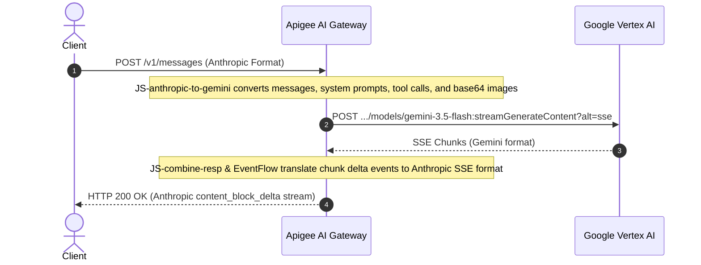

# 🔄 Universal Protocol Normalization

The AI Gateway decouples client application SDKs from backend model implementations through real-time bidirectional translation.

---

## 1. Supported Ingress Endpoints

| Endpoint | Ingress Format | Supported Backends |
| :--- | :--- | :--- |
| **`/v1/messages`** | Anthropic Claude Messages API | Anthropic Claude (`us-east5`), Google Gemini (`global`), Custom OpenAI endpoints |
| **`/ai-gateway`** | Native Gemini / Vertex Predict API | Native Gemini (`global`), Claude (`us-east5`) |
| **`/v1/chat/completions`** | OpenAI Chat Completions API | Gemini OpenAI Compatibility Endpoint, Self-hosted vLLM/Ollama |
| **`/v1/models`** | OpenAI / Anthropic Catalog Discovery | Dynamic In-Memory Propertyset Model Catalog |

---

## 2. Request Translation Pipeline

---

## 3. Streaming Support (SSE Transcoding)

Both streaming (`stream: true`) and non-streaming requests are supported across all protocols:
* **Anthropic SSE:** Translates `message_start`, `content_block_start`, `content_block_delta`, `message_delta`, and `message_stop`.
* **Gemini SSE:** Parses chunk candidates and normalizes usage metadata from stream trailers.
* **Token Accumulation:** Token consumption is aggregated in real time in `EventFlow` to accurately decrement quotas and calculate micro-costs on completion.
