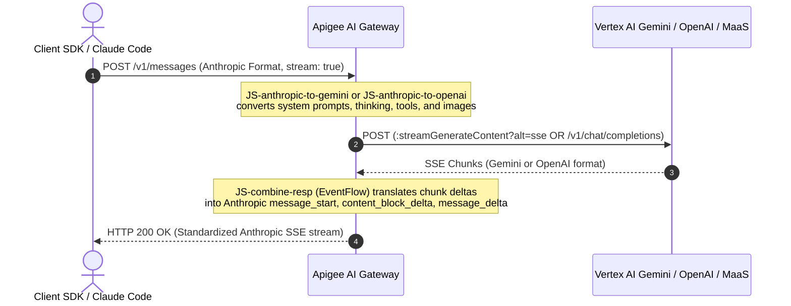

# Protocol Normalization, CLI Support & Embeddings

The AI Gateway decouples client application SDKs and developer CLI tools (`Claude Code`, `Codex`, OpenAI SDK, Anthropic SDK, Vertex AI SDK) from backend model implementations through real-time bidirectional translation.

---

## 1. Supported Ingress Endpoints & 4×3 Transcoding Matrix

| Ingress Client Endpoint | Target Backend: **OpenAI** *(Direct OpenAI / MaaS / vLLM / Azure)* | Target Backend: **Anthropic** *(Vertex Claude / Claude Direct)* | Target Backend: **Gemini** *(Google Vertex AI)* |
| :--- | :---: | :---: | :---: |
| **Claude SDK / Claude Code** `POST /v1/messages` | **Full Transcoding** *(Claude &harr; OpenAI schema + SSE)* | **Native Passthrough** *(Direct routing + auth injection)* | **Full Transcoding** *(Claude &harr; Gemini schema + SSE)* |
| **OpenAI SDK / Codex** `POST /v1/chat/completions` | **Native Passthrough** *(Direct routing + auth injection)* | **Full Transcoding** *(OpenAI &harr; Claude schema + SSE)* | **Full Transcoding** *(OpenAI &harr; Gemini schema + SSE)* |
| **Embeddings SDK** `POST /v1/embeddings` | **Native Passthrough** *(OpenAI / vLLM `/v1/embeddings`)* | N/A | **Full Transcoding** *(OpenAI &harr; Vertex `:predict`)* |
| **Vertex AI / ADK SDK** `POST /ai-gateway` | **Via OpenAI Endpoint** *(Clients use `/v1/chat/completions`)* | **Native Passthrough** *(Direct to Claude `:rawPredict`)* | **Native Passthrough** *(Direct to Gemini `:generateContent`)* |
| **Catalog Discovery** `GET /v1/models` | **OpenAI Format** | **Anthropic Format** | **Dynamic Catalog** |

---

## 2. First-Class Developer CLI Support (`Claude Code` & `Codex`)

Agentic developer CLIs send complex multi-block payloads that standard API proxies often reject or corrupt during translation. The AI Gateway's OpenAPI validation specs and JavaScript transcoders (`anthropic_to_gemini.js`, `anthropic_to_openai.js`, `openai_to_anthropic.js`) natively support:

* **Extended Thinking Blocks:** Preserves and translates `thinking` (`{type: "thinking", thinking: "...", signature: "..."}`) and `redacted_thinking` blocks across multi-turn agentic loops, mapping `thinking.budget_tokens` to Gemini `thinkingConfig.thinkingBudget` or OpenAI `reasoning_effort`.
* **Rich Tool Use & Parallel Function Calling:** Full bidirectional mapping between Anthropic `tool_use` / `tool_result` blocks, OpenAI `tool_calls` / `role: "tool"` messages, and Gemini `functionCall` / `functionResponse` parts (including structured array content inside `tool_result`).
* **Multimodal & Document Blocks:** Translates base64 images (`image/jpeg`, `image/png`, `image/webp`) and PDF/text `document` blocks seamlessly.
* **Prompt Caching Metadata:** Preserves `cache_control: {"type": "ephemeral"}` breakpoints on system prompts, tools, and message blocks, and extracts `cache_read_input_tokens`, `cache_creation_input_tokens`, `cached_tokens`, and `cachedContentTokenCount` on egress.

---

## 3. Request & Streaming SSE Translation Pipeline

```mermaid
sequenceDiagram
    autonumber
    actor Client as Client SDK / Claude Code
    participant Proxy as Apigee AI Gateway
    participant Backend as Vertex AI Gemini / OpenAI / MaaS

    Client->>Proxy: POST /v1/messages (Anthropic Format, stream: true)
    Note over Proxy: JS-anthropic-to-gemini or JS-anthropic-to-openai<br/>converts system prompts, thinking, tools, and images
    Proxy->>Backend: POST (:streamGenerateContent?alt=sse OR /v1/chat/completions)
    Backend-->>Proxy: SSE Chunks (Gemini or OpenAI format)
    Note over Proxy: JS-combine-resp (EventFlow) translates chunk deltas<br/>into Anthropic message_start, content_block_delta, message_delta
    Proxy-->>Client: HTTP 200 OK (Standardized Anthropic SSE stream)
```

### Streaming SSE Normalization (`combine_resp.js`)
Both streaming (`stream: true`) and non-streaming requests are supported across all protocols:
* **Anthropic Ingress (`claude-messages`):** Translates both Gemini SSE chunks and OpenAI SSE chunks (`choices[].delta.content`, `choices[].delta.reasoning_content`, `choices[].delta.tool_calls`) into standardized Anthropic SSE events (`message_start`, `content_block_start`, `content_block_delta`, `message_delta`, `message_stop`).
* **OpenAI Ingress (`openai-compat`):** Translates Anthropic SSE events into OpenAI `chat.completion.chunk` SSE events (`data: {...}\n\n` followed by `data: [DONE]\n\n`).
* **Real-Time Token & Cost Accumulation:** Extracts final token usage (including cached and reasoning tokens) from stream trailers to accurately decrement rolling quotas and compute micro-transaction USD costs before the stream closes.

---

## 4. Vector Embeddings Normalization (`POST /v1/embeddings`)

The `openai-embeddings` ProxyEndpoint (`/v1/embeddings`) provides a unified OpenAI-compatible embeddings interface across both **Direct OpenAI / vLLM** and **Google Vertex AI (`text-embedding-005`, `text-multilingual-embedding-002`)**:

1. **OpenAI Target (`route_target = "openai-custom"`):** Forwards the OpenAI `/v1/embeddings` payload directly to `api.openai.com/v1/embeddings` (or custom URL) with per-client OpenAI API key injection.
2. **Vertex AI Target (`route_target = "gemini"`):**
   * **Request (`JS-openai-to-vertex-embeddings`):** Transforms OpenAI `{"model": "text-embedding-005", "input": ["hello", "world"], "dimensions": 768}` into Vertex AI `:predict` format (`{"instances": [{"content": "hello"}, {"content": "world"}], "parameters": {"outputDimensionality": 768}}`).
   * **Response (`JS-vertex-to-openai-embeddings`):** Transforms Vertex AI `predictions[].embeddings.values` and `statistics.token_count` back into an OpenAI `{"object": "list", "data": [{"object": "embedding", "index": 0, "embedding": [...]}], "usage": {"prompt_tokens": N, "total_tokens": N}}` response.
