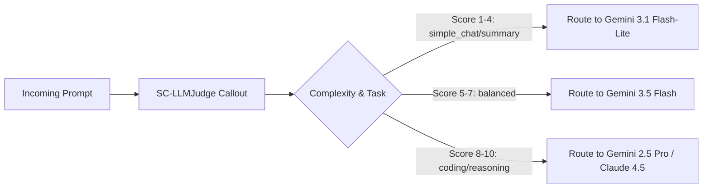

# ⚡ Smart Routing & LLM as a Judge

The gateway provides intelligent request routing to optimize latency, cost, and output quality across multiple LLM providers.

---

## 1. Cost Tier Optimization

Clients can supply an abstract cost tier instead of hardcoding model names:

```json
{
  "plugins": [
    { "id": "auto-router", "cost_tier": "low" }
  ],
  "messages": [
    { "role": "user", "content": "Classify this support ticket as urgent or normal." }
  ]
}
```

* `cost_tier: "low"` → **Gemini 3.1 Flash-Lite** (`global`)
* `cost_tier: "medium"` → **Gemini 3.5 Flash** (`global`)
* `cost_tier: "high"` → **Gemini 2.5 Pro** (`global`)
* `cost_tier: "max"` → **Claude 4.5 Haiku** (`us-east5`)


---

## 2. Cascading Fallback Chains

Specify prioritized fallback models to guarantee high availability:

```json
{
  "models": ["claude-haiku-4-5", "gemini-3.5-flash", "gemini-3.1-flash-lite"],
  "messages": [{"role": "user", "content": "Analyze annual report."}]
}
```

---

## 3. Real-Time LLM as a Judge

When the requested model is `auto:judge` or the `X-Gateway-Judge: true` header is provided, the gateway invokes an inline classifier (`SC-LLMJudge`) powered by **Gemini 3.1 Flash-Lite**:


