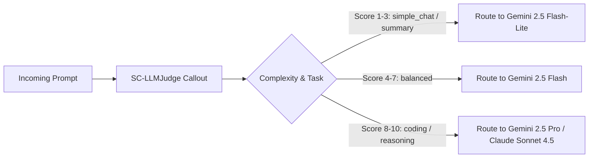

# ⚡ Smart Routing, Fallbacks, Aliases & LLM Judge

The gateway provides **4 intelligent request routing mechanisms** inside `JS-resolve-model-location` to optimize latency, cost, and availability across multiple LLM providers without requiring application code changes.

---

## 1. Quick Decision Matrix: Which Routing Strategy Should You Use?

| Strategy | Client Request Syntax | Best For | Latency Overhead |
| :--- | :--- | :--- | :---: |
| **1. Model Aliases** | `"model": "gpt-5.4"` &rarr; rewrites to `gemini-2.5-pro` | Migrating legacy OpenAI/Claude apps to Vertex AI with **zero client code changes**. | **`0ms`** |
| **2. Abstract Cost Tiers** | `X-Model-Cost-Tier: low` *(or `"model": "auto:low"`)* | Decoupling client apps from specific model versions (`low`, `medium`, `high`, `max`). | **`0ms`** |
| **3. Cascading Fallbacks** | `"models": ["claude-sonnet-4-5", "gemini-2.5-pro"]` | High-availability workloads that need automatic failover across providers. | **`0ms`** |
| **4. Real-Time LLM Judge** | `"model": "auto:judge"` *(or `X-Gateway-Judge: true`)* | Automatically routing simple queries to cheap Flash-Lite models and hard reasoning queries to Pro/Sonnet. | **`~80–150ms`** |

---

## 2. Model Aliases (`alias.*`)

Configure transparent model rewrites under `routing.aliases` in `values.yaml` (compiled into `model_locations.properties`):

```yaml
routing:
  aliases:
    "gpt-5.4": "gemini-2.5-pro"
    "gpt-5.4-mini": "gemini-2.5-flash-lite"
    "claude-3-5-sonnet": "claude-sonnet-4-5"
```
* Preserves the client's original intent in `X-Gateway-Requested-Model` (`dc_requested_model`) while routing and billing against the resolved model (`X-Gateway-Routed-Model` / `dc_model`).

---

## 3. Cost Tier Optimization (`tier.*`)

Clients can supply an abstract cost tier via the `X-Model-Cost-Tier` header, `"model": "auto:low"`, or `plugins: [{"id": "auto-router", "cost_tier": "low"}]`:

```json
{
  "plugins": [
    { "id": "auto-router", "cost_tier": "low" }
  ],
  "messages": [
    { "role": "user", "content": "Classify this support ticket as urgent or normal." }
  ]
}
```

* `cost_tier: "low"` &rarr; **Gemini 2.5 Flash-Lite** (`global`)
* `cost_tier: "medium"` &rarr; **Gemini 2.5 Flash** (`global`)
* `cost_tier: "high"` &rarr; **Gemini 2.5 Pro** (`global`)
* `cost_tier: "max"` &rarr; **Claude Sonnet 4.5** (`us-east5`)

---

## 4. Cascading Fallback Chains (`models: [...]`)

Specify prioritized fallback models in the request payload. The Smart Router selects the first configured and available model in the array:

```json
{
  "models": ["claude-sonnet-4-5", "gemini-2.5-pro", "gemini-2.5-flash"],
  "messages": [{"role": "user", "content": "Analyze annual report."}]
}
```

---

## 5. Real-Time LLM as a Judge (`auto:judge`)

When the requested model is `auto:judge` or the `X-Gateway-Judge: true` header is provided, the gateway invokes an inline classifier (`SC-LLMJudge`) powered by **Gemini 2.5 Flash-Lite**:


```mermaid
graph LR
    Req[Incoming Prompt] --> Judge[SC-LLMJudge Callout]
    Judge --> Eval{Complexity & Task}
    Eval -->|Score 1-3: simple_chat / summary| Low[Route to Gemini 2.5 Flash-Lite]
    Eval -->|Score 4-7: balanced| Med[Route to Gemini 2.5 Flash]
    Eval -->|Score 8-10: coding / reasoning| High[Route to Gemini 2.5 Pro / Claude Sonnet 4.5]
```

