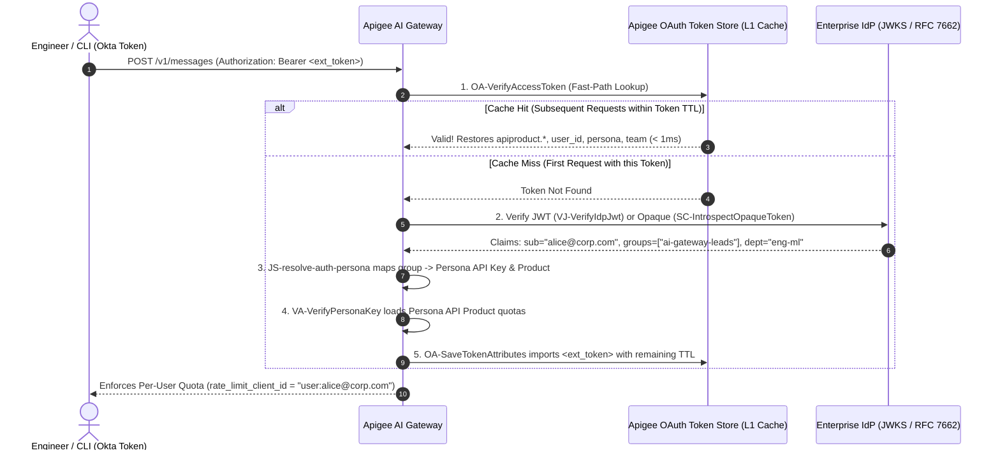

# 🔒 Enterprise Auth, Persona Token Import & Model Armor

The Apigee AI Gateway enforces **Zero-Passthrough Authentication** on ingress and **Google Cloud Model Armor** sanitization on both prompts and streaming completions.

---

## 1. Which Authentication Option Should You Use?

All 4 authentication options can run simultaneously on the same gateway. The proxy automatically inspects the incoming headers (`x-apikey`, `x-api-key`, or `Authorization: Bearer ...`) and routes the token through the matching verification path:

| Auth Option | Credential Header | Best For | How It Works | Repeat-Call Latency |
| :--- | :--- | :--- | :--- | :---: |
| **Option 1: API Key**<br>*(Dual-Header)* | `x-apikey: <key>`<br>*or* `x-api-key: <key>` | **Developer CLIs (`Claude Code`, `Codex`)** & quick prototyping | `JS-extract-auth-credentials` normalizes `x-api-key` &rarr; `x-apikey` and validates via `VA-ApiKey`. | **`< 1ms`** |
| **Option 2: Apigee OAuthV2** | `Authorization: Bearer <token>` | **Apps already using Apigee as OAuth Server** | Validated directly in Apigee's token store via `OA-VerifyAccessToken`. | **`< 1ms`** |
| **Option 3: GCP Agent Identity** | `Authorization: Bearer ya29.*` | **Autonomous Agents on Vertex AI, Cloud Run, GKE** | Verifies Google IAM `ya29.*` token via `SC-VerifyGoogleTokenInfo` on first seen, then caches in Apigee L1 cache (`PC-CacheAgentToken`). | **`< 1ms`** *(cached)* |
| **Option 4: Enterprise IdP Token Import**<br>*(Okta, Ping, Entra ID)* | `Authorization: Bearer <opaque-or-jwt>` | **Large Engineering Orgs using Corporate SSO** | Validates Opaque token (RFC 7662) or JWT (JWKS), maps IdP group to a **Persona API Product**, and imports external token into Apigee (`OA-SaveTokenAttributes`). | **`< 1ms`** *(imported)* |

> [!IMPORTANT]
> **Zero-Passthrough Guarantee:** Unauthenticated requests—or requests whose Bearer token fails all configured verification paths—are immediately rejected with `401 Unauthorized` (`RF-Unauthorized`) before any LLM Judge, Model Armor, or Target callout executes.

---

## 2. How Enterprise IdP Token Import & Persona Mapping Works ("Less Is More")

When onboarding thousands of human engineers or autonomous agents via an external Identity Provider (Okta, PingFederate, Microsoft Entra ID), a common anti-pattern is syncing every individual employee into Apigee as a Developer and Developer App.

Instead, the AI Gateway uses the battle-tested **Persona-to-Product + Token Import** architecture:



### Why This Simplifies Enterprise Adoption
1. **Manage 4 Personas Instead of 10,000 Users:** You only create **3 to 5 Persona API Products** in Apigee (e.g., `lead-ai-engineer`, `power-developer`, `developer-default`, `contractor-restricted`).
2. **Per-User Quota Isolation Without Per-User Apps:** Even though 500 engineers share the `power-developer` API Product, `JS-resolve-auth-persona` sets `rate_limit_client_id = "user:alice@corp.com"` (and `dc_identity_user_id = "alice@corp.com"`). Every engineer gets their own dedicated token quota bucket and analytics attribution!
3. **`< 1ms` Repeat-Call Performance:** Because `OA-SaveTokenAttributes` (`<ExternalAuthorization>true</ExternalAuthorization>`, `<StoreToken>true</StoreToken>`) imports the external Bearer token directly into Apigee's native OAuth store using the token's exact remaining `expires_in` TTL, every subsequent request hits `OA-VerifyAccessToken` in **`< 1ms`** without calling the IdP again.

### Configuring Persona Mappings in `values.yaml`

```yaml
features:
  auth:
    enabled: true
    personas:
      claim_name: "groups"
      default_persona: "developer-default"
      mappings:
        "ai-gateway-leads": "lead-ai-engineer:DEMO_KEY_LEAD_PERSONA"
        "ai-gateway-PowerUsers": "power-developer:DEMO_KEY_POWER_PERSONA"
        "ai-gateway-contractors": "contractor-restricted:DEMO_KEY_CONTRACTOR_PERSONA"
        "default": "developer-default:DEMO_KEY_DEFAULT_PERSONA"
```

---

## 3. Google Cloud Model Armor (Prompt & Response Sanitization)

Enterprise content safety is enforced at both input and output boundaries using **Google Cloud Model Armor**:

### Prompt Sanitization (Ingress)
Every incoming prompt is extracted and sanitized before reaching the LLM target:

```xml
<SanitizeUserPrompt name="SUP-SanitizeUserPrompt">
  <ModelArmor>
    <TemplateName>projects/{propertyset.config.model_armor_project_id}/locations/global/templates/{propertyset.config.model_armor_template}</TemplateName>
  </ModelArmor>
  <UserPromptSource>{extracted_prompt}</UserPromptSource>
</SanitizeUserPrompt>
```

* **Sensitive Data Protection (SDP):** Detects and masks PII, credit cards, credentials, and API keys.
* **Prompt Injection & Jailbreak Detection:** Blocks jailbreak attempts and system instruction overrides with a structured `400 Bad Request` error (`AM-CustomError`).

### Model Response Sanitization (Egress & Streaming)
Generated model responses and SSE chunks are filtered in `PostFlow` and `EventFlow` via `SMR-SanitizeModelResponse`:
* **De-identification Findings:** Detected violations trigger custom error responses or content redaction via `JS-inject-deidentified-finding`.
* **Toxicity & Harm Filters:** Blocks unsafe completions before they reach the client application.

