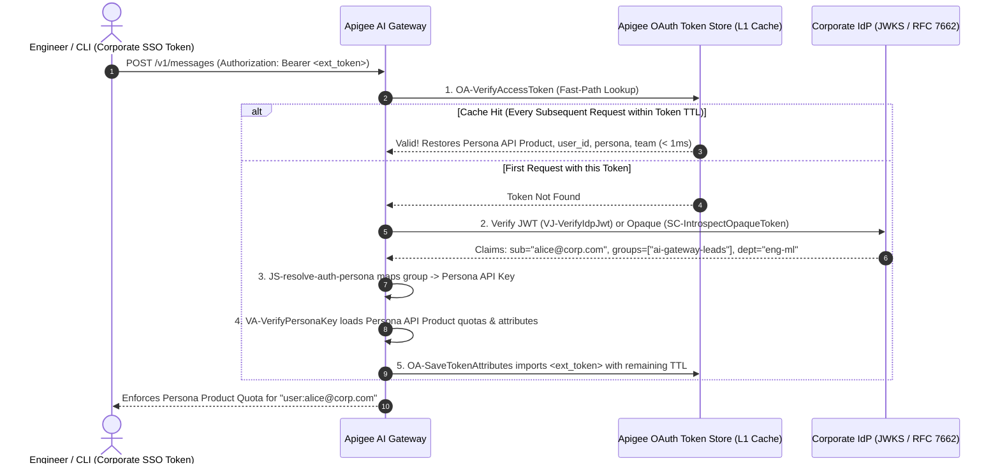

# API Products, Persona-Based Auth & Model Armor

The most important architectural goal of the Apigee AI Gateway is **scaling to thousands of developers, employees, and autonomous agents without managing per-user keys or budgets inside the gateway.**

---

## 1. The Core Abstraction: Why API Products Beat Per-User Provisioning

When rolling out AI tools (`Claude Code`, `Codex`, internal chat apps, and autonomous agents) across an enterprise, a common trap is creating a separate gateway user, virtual key, or custom policy for every individual employee. At 10,000 employees, per-user gateway management becomes an operational bottleneck and creates high-cardinality state bloat.

The Apigee AI Gateway solves this by separating **Policy Definition (Low-Cardinality API Products)** from **Runtime Enforcement (Per-User & Per-Team Counters)**:

```mermaid
graph LR
    subgraph Callers["10,000+ Enterprise Callers (Any Credential)"]
        U1["Human Engineers<br/>(Okta / Entra / Ping SSO)"]
        U2["Autonomous Agents<br/>(GCP IAM ya29.*)"]
        U3["Service Apps & CLIs<br/>(Apigee API Key / OAuth)"]
    end

    subgraph Abstraction["Low-Cardinality Governance (3–5 API Products)"]
        P1["API Product: lead-ai-engineer<br/>(2M tokens / 4h, Opus + Pro enabled)"]
        P2["API Product: power-developer<br/>(500k tokens / 4h, Sonnet + Pro)"]
        P3["API Product: developer-default<br/>(100k tokens / 4h, Haiku + Flash)"]
        P4["API Product: contractor-restricted<br/>(50k tokens / 4h, Flash-Lite only)"]
    end

    subgraph Runtime["Isolated Runtime Counters & Telemetry"]
        Q1["Per-User Quota Bucket<br/>(rate_limit_client_id = user:alice@corp.com)"]
        Q2["Shared Team Budget Pool<br/>(secondary_quota_identifier = team:eng-ml)"]
        Q3["Per-User Cost & Token Analytics<br/>(dc_identity_user_id, persona, team)"]
    end

    Callers -->|"Mapped via IdP Group<br/>or App Binding"| Abstraction
    Abstraction -->|"Enforced per Individual<br/>at Runtime"| Runtime
```



### Why This Architecture Scales Effortlessly
1. **Manage 4 API Products, Not 10,000 Users:** You define token quotas, per-model limits, burst rates, and allowed endpoints once on **3 to 5 Persona API Products** in Apigee. You never have to sync employee joiners/movers/leavers into Apigee's database.
2. **Isolated Per-User Quotas Out of the Box:** Even though 2,000 engineers share the `power-developer` API Product, they do **not** share a single token bucket. At runtime, Apigee keys the quota counter by the caller's unique identity (`rate_limit_client_id = "user:alice@corp.com"`), giving every engineer their own isolated 500k token allowance.
3. **Instant Tier Changes via Your Existing IdP:** Moving an engineer from `developer-default` to `power-developer` is just an AD/Okta group change—zero Apigee configuration changes required.
4. **Granular Exceptions When Needed:** If one specific engineer needs a temporary 5M token boost for a release, you can attach a time-bound `quota_override` + `quota_override_expires_at` attribute without creating a new API Product.

---

## 2. How Callers Connect: All Credentials Resolve to an API Product

You do not have to choose a single authentication format for your gateway. All 4 credential types can run simultaneously on the same proxy, and **every one of them resolves to an Apigee API Product**:

| Caller Type | Credential Sent by Client | How It Maps to an Apigee API Product | Repeat-Call Latency |
| :--- | :--- | :--- | :---: |
| **1. Direct Apps & CLIs** | `x-apikey: <key>` *or* `x-api-key: <key>` | Directly bound to an Apigee Developer App and its assigned **API Product** via `VA-ApiKey`. | **`< 1ms`** |
| **2. Apigee OAuth Apps** | `Authorization: Bearer <apigee-token>` | Directly bound to an Apigee Developer App and **API Product** via `OA-VerifyAccessToken`. | **`< 1ms`** |
| **3. Cloud Agents (Vertex / Cloud Run / GKE)** | `Authorization: Bearer ya29.*` | Verified via Google TokenInfo (`SC-VerifyGoogleTokenInfo`), cached in L1 (`PC-CacheAgentToken`), and mapped to an Agent **Persona API Product**. | **`< 1ms`** *(cached)* |
| **4. Engineers using Corporate SSO (Okta / Ping / Entra ID)** | `Authorization: Bearer <jwt-or-opaque>` | Verified via JWKS (`VJ-VerifyIdpJwt`) or RFC 7662 (`SC-IntrospectOpaqueToken`), mapped from IdP `groups` to a **Persona API Product**, and **imported into Apigee's token store** (`OA-SaveTokenAttributes`). | **`< 1ms`** *(imported)* |

> [!IMPORTANT]
> **Zero-Passthrough Guarantee:** Unauthenticated requests—or requests whose credential fails verification—are immediately rejected with `401 Unauthorized` (`RF-Unauthorized`) before any LLM Judge, Model Armor, or Target callout executes.

---

## 3. Under the Hood: `< 1ms` Enterprise IdP Token Import

For corporate SSO tokens (JWT or Opaque), calling an external IdP introspection endpoint on every LLM request would add 30–100ms of latency. Instead, the gateway uses Apigee's native **Token Import** pattern (`OA-SaveTokenAttributes`):



### Configuring Group-to-Persona Mappings in `values.yaml`

```yaml
features:
  auth:
    enabled: true
    personas:
      claim_name: "groups"                            # Claim in your JWT or Opaque introspection response
      default_persona: "developer-default"            # Fallback persona if no group matches
      mappings:                                       # IdP Group -> Persona Name:API_KEY_OF_PERSONA_APP
        "ai-gateway-leads": "lead-ai-engineer:DEMO_KEY_LEAD_PERSONA"
        "ai-gateway-PowerUsers": "power-developer:DEMO_KEY_POWER_PERSONA"
        "ai-gateway-contractors": "contractor-restricted:DEMO_KEY_CONTRACTOR_PERSONA"
        "default": "developer-default:DEMO_KEY_DEFAULT_PERSONA"
```

---

## 4. Google Cloud Model Armor (Prompt & Response Sanitization)

Enterprise content safety is enforced at both input and output boundaries using **Google Cloud Model Armor**:

### Prompt Sanitization (Ingress)
Every incoming prompt is extracted and sanitized before reaching the LLM target:

```xml
<SanitizeUserPrompt name="SUP-SanitizeUserPrompt">
  <ModelArmor>
    <TemplateName>projects/{propertyset.config.model_armor_project_id}/locations/global/templates/{propertyset.config.model_armor_template}</TemplateName>
  </ModelArmor>
  <UserPromptSource>{extracted_prompt}</UserPromptSource>
</SanitizeUserPrompt>
```

* **Sensitive Data Protection (SDP):** Detects and masks PII, credit cards, credentials, and API keys.
* **Prompt Injection & Jailbreak Detection:** Blocks jailbreak attempts and system instruction overrides with a structured `400 Bad Request` error (`AM-CustomError`).

### Model Response Sanitization (Egress & Streaming)
Generated model responses and SSE chunks are filtered in `PostFlow` and `EventFlow` via `SMR-SanitizeModelResponse`:
* **De-identification Findings:** Detected violations trigger custom error responses or content redaction via `JS-inject-deidentified-finding`.
* **Toxicity & Harm Filters:** Blocks unsafe completions before they reach the client application.
