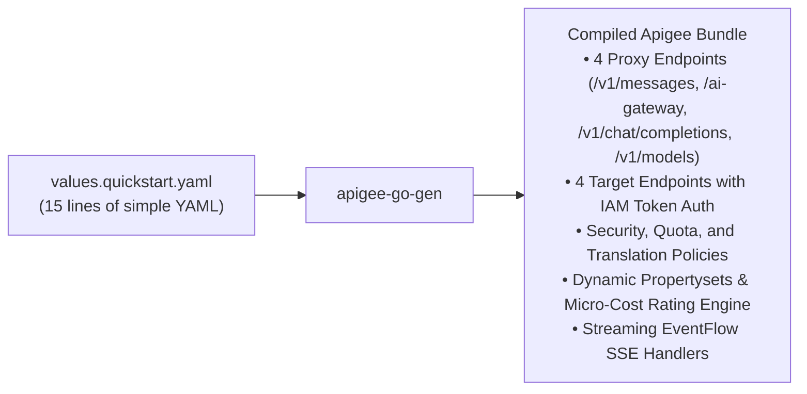

# Quickstart: 5-Minute Minimal Template

Want to get an enterprise-grade AI Gateway up and running immediately? You don't need to touch complex XML policies or configure dozens of separate files.

With the **AI Gateway Template**, a simple **15-line YAML file** is all you need to generate a full, production-ready Apigee gateway with universal protocol normalization, token monetization, and custom backend model routing.

> [!NOTE]
> **Prerequisites:** Ensure you have `apigee-go-gen` and `apigeecli` installed. If you haven't installed them yet, see the [Installation & Setup Guide](installation.md).

---

## The Minimal `values.quickstart.yaml`


```yaml
gateway:
  name: "ai-gateway-quickstart"
  project_id: "your-gcp-project-id"

models:
  # 1. Google Gemini on Vertex AI
  - name: "gemini-2.5-flash"
    displayName: "Gemini 2.5 Flash"
    publisher: "google"
    format: "gemini"
    region: "global"
    is_default: true

  # 2. Anthropic Claude on Vertex AI
  - name: "claude-haiku-4-5"
    displayName: "Claude 4.5 Haiku"
    publisher: "anthropic"
    format: "anthropic"
    region: "us-east5"

  # 3. Optional: Self-Hosted Model (OpenAI format)
  - name: "my-vllm-model"
    displayName: "Llama 3 (Self-Hosted)"
    format: "openai"
    custom_url: "https://vllm.internal.corp/v1/chat/completions"
```

---

## What Happens Under the Hood

When you execute:

```bash
apigee-go-gen render apiproxy \
    --template ./templates/ai-gateway/apiproxy.yaml \
    --values ./templates/ai-gateway/values.quickstart.yaml \
    --output ./out/ai-gateway.zip
```

`apigee-go-gen` automatically compiles your YAML into a complete **Apigee API proxy bundle**:



---

## Deploy to Apigee

```bash
apigeecli apis create bundle \
    --proxy-zip ./out/ai-gateway.zip \
    --name ai-gateway \
    --org "$PROJECT_ID" \
    --env "$APIGEE_ENV" \
    --ovr \
    --wait \
    --default-token
```

---

## Test Your Gateway

Now, any client SDK can communicate with your models:

```bash
# Call Gemini or Claude using Anthropic SDK format
curl -X POST "https://$APIGEE_HOSTNAME/v1/messages" \
  -H "x-apikey: $API_KEY" \
  -H "Content-Type: application/json" \
  -d '{
    "model": "gemini-2.5-flash",
    "messages": [{"role": "user", "content": "Explain quantum computing in one sentence."}]
  }'
```

