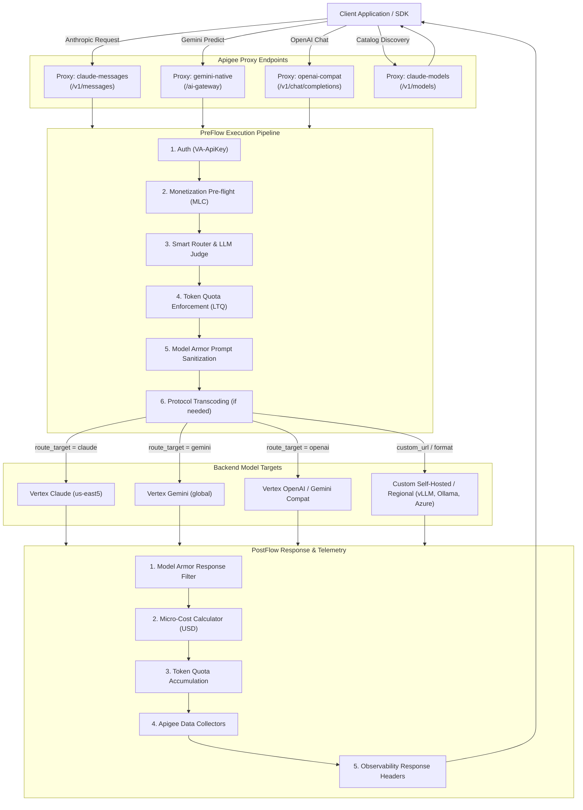

# 🚀 Apigee AI Gateway

Welcome to the documentation for the **Enterprise AI Gateway** built on Google Cloud Apigee and configured declaratively using [`apigee-go-gen`](https://github.com/apigee/apigee-go-gen).

The AI Gateway provides a unified, production-grade control plane for generative AI workloads across Anthropic Claude, OpenAI, Google Gemini on Vertex AI, and self-hosted open-source models (vLLM, Ollama, Groq, Azure OpenAI).

---

## 🌟 Key Capabilities

-   :material-swap-horizontal: **Universal Protocol Normalization**
    
    ---
    
    Accepts Claude (`/v1/messages`), Gemini (`/ai-gateway`), or OpenAI (`/v1/chat/completions`) schemas and automatically transcodes them to match any target backend model format with streaming support.

-   :material-routes: **Smart Routing & LLM as a Judge**
    
    ---
    
    Dynamically routes requests using cost tiers (`low`, `medium`, `high`, `max`), cascading fallback chains, or real-time prompt complexity classification powered by Gemini 3.1 Flash-Lite.

-   :material-shield-check: **Enterprise Security (GCP Model Armor)**
    
    ---
    
    Inspects and sanitizes user prompts and model completions against sensitive data leakage, toxic content, and prompt injection attacks with automated de-identification.

-   :material-credit-card-outline: **Token Monetization & Micro-Transactions**
    
    ---
    
    Enforces prepaid wallet credit limits in pre-flight, calculates exact token consumption costs in real-time, and integrates directly with Apigee Monetization rating engines.

-   :material-tune: **Declarative Helm-Style Templates**
    
    ---
    
    Single `values.yaml` configuration drives the entire gateway bundle generation, supporting custom URLs, regional endpoints, and modular feature toggling.

-   :material-chart-box: **Comprehensive Telemetry & Observability**
    
    ---
    
    Injects rich `X-Gateway-*` observability headers and logs detailed token counts, models, and transaction costs into Apigee Analytics Data Collectors.

---

## 🏛 Architecture Diagram

---

## ⚡ Getting Started

* **Fastest Path (30 Seconds):** Check out the [30-Second Quickstart Template](getting-started/quickstart-template.md) to generate a gateway with 20 lines of YAML.
* **Full Walkthrough:** Follow the [Full Quickstart Guide](getting-started/quickstart.md).
* **Architecture Deep Dive:** Explore the [Choose Your Workflow Guide](getting-started/choose-workflow.md) and [Template Configuration](template-guide/configuration.md).

