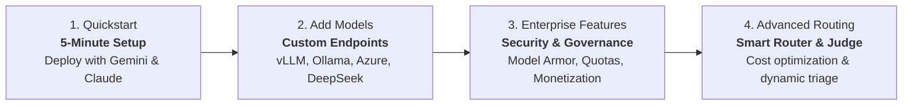

#  Apigee AI Gateway

Welcome to the documentation for the **Enterprise AI Gateway** on Google Cloud Apigee.

The AI Gateway provides a unified, production-grade control plane for generative AI workloads across Anthropic Claude, OpenAI, Google Gemini on Vertex AI, and self-hosted models (vLLM, Ollama, Groq, Azure OpenAI) — configured declaratively through simple YAML.

---

## Progressive Adoption Journey

The repository is designed to let you start simple and add capabilities as your requirements grow:

1. **[Quickstart (5 Minutes)](getting-started/quickstart-template.md)**: Deploy a working gateway with 15 lines of YAML supporting Gemini and Claude.
2. **[Configuration Reference (`values.yaml`)](template-guide/configuration.md)**: Complete reference of all template schema options, metadata, and defaults.
3. **[Custom Providers & URLs](template-guide/custom-urls.md)**: Connect external APIs (Azure, DeepSeek) and private clusters (vLLM, Ollama) with custom auth.
4. **[Enterprise Feature Toggles](template-guide/feature-flags.md)**: Enable Model Armor prompt/response sanitization, token quotas, and monetization.
5. **[Smart Routing & LLM as a Judge](architecture/routing.md)**: Automatically route prompts based on cost tiers and complexity.

---

## Core Capabilities

-   :material-swap-horizontal: **Universal Protocol Normalization**
    
    ---
    
    Accepts Claude (`/v1/messages`), Gemini (`/ai-gateway`), or OpenAI (`/v1/chat/completions`) schemas and automatically transcodes them across any backend provider with real-time SSE streaming.

-   :material-routes: **Smart Routing & LLM as a Judge**
    
    ---
    
    Dynamically routes requests using cost tiers (`low`, `medium`, `high`, `max`), fallback chains, or real-time prompt complexity classification powered by Gemini 3.1 Flash-Lite.

-   :material-shield-check: **Enterprise Security (GCP Model Armor)**
    
    ---
    
    Inspects and sanitizes user prompts and model completions against sensitive data leakage, toxic content, and prompt injection attacks with automated de-identification.

-   :material-credit-card-outline: **Token Monetization & Quotas**
    
    ---
    
    Enforces prepaid wallet credit limits in pre-flight, calculates exact token consumption costs in real-time, and integrates directly with Apigee rate plans and quotas.

-   :material-tune: **Declarative Configuration**
    
    ---
    
    Single `values.yaml` file drives the entire gateway bundle generation, supporting custom URLs, regional endpoints, and modular feature toggling.

-   :material-chart-box: **Telemetry & Observability**
    
    ---
    
    Injects standard observability headers and logs detailed token counts, model identifiers, and transaction costs into Apigee Analytics Data Collectors.

---

## Architecture Overview

```mermaid
graph LR
    subgraph Clients["Client Applications"]
        C1["OpenAI SDK"]
        C2["Anthropic Claude SDK"]
        C3["Vertex AI SDK"]
    end

    subgraph Gateway["Apigee AI Gateway"]
        direction TB
        G1["Universal Protocol Normalization"]
        G2["Model Armor Security & PII Sanitization"]
        G3["Smart Routing & Cost Optimization"]
        G4["Token Quotas & Monetization"]
    end

    subgraph Providers["Backend LLM Providers"]
        P1["Google Vertex AI (Gemini & Claude)"]
        P2["Third-Party APIs (OpenAI, Azure, DeepSeek)"]
        P3["Self-Hosted Clusters (vLLM, Ollama)"]
    end

    Clients --> Gateway
    Gateway --> Providers
```

> Looking for the complete 25-step policy execution sequence? See the [Pipeline Execution Flow (Appendix)](proxy-deep-dive/bundle-structure.md#3-appendix-end-to-end-pipeline-execution-flow).

---

## Documentation & Template Guides

-   :material-file-code-outline: **[Configuration Reference](template-guide/configuration.md)**
    
    ---
    
    Complete schema specification for `values.yaml` covering gateway metadata, endpoints, models, routing tiers, and pricing.

-   :material-server-network: **[Custom Providers & URLs](template-guide/custom-urls.md)**
    
    ---
    
    How to connect self-hosted LLMs (vLLM, Ollama), third-party providers (DeepSeek, Azure OpenAI), and upstream bearer/header authentication.

-   :material-toggle-switch: **[Feature Toggles](template-guide/feature-flags.md)**
    
    ---
    
    Enable or disable Model Armor security, token monetization, rate quotas, and LLM Judge evaluation.

-   :material-rocket-launch: **[5-Minute Quickstart](getting-started/quickstart-template.md)**
    
    ---
    
    Deploy a working AI Gateway bundle using the minimal 15-line starter configuration.

