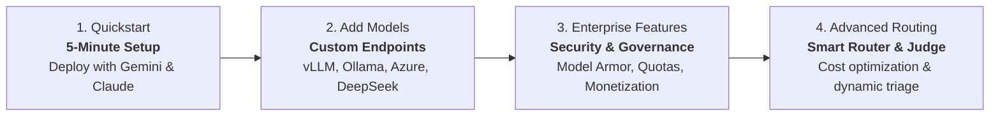
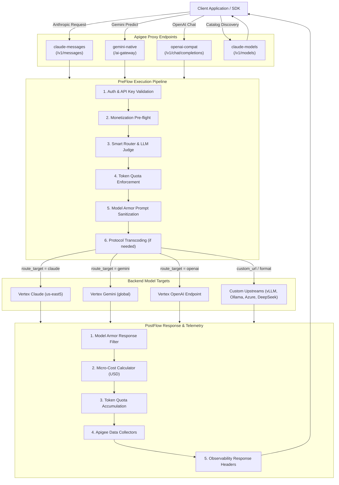

# Apigee AI Gateway

Welcome to the documentation for the **Enterprise AI Gateway** on Google Cloud Apigee, configured declaratively using [`apigee-go-gen`](https://github.com/apigee/apigee-go-gen).

The AI Gateway provides a unified, production-grade control plane for generative AI workloads across Anthropic Claude, OpenAI, Google Gemini on Vertex AI, and self-hosted models (vLLM, Ollama, Groq, Azure OpenAI).

---

## Progressive Adoption Journey

The repository is designed to let you start simple and add capabilities as your requirements grow:

1. **[Quickstart (5 Minutes)](getting-started/quickstart-template.md)**: Deploy a working gateway with 15 lines of YAML supporting Gemini and Claude.
2. **[Custom Providers & URLs](template-guide/custom-urls.md)**: Connect external APIs (Azure, DeepSeek) and private clusters (vLLM, Ollama) with custom auth.
3. **[Enterprise Features](template-guide/feature-flags.md)**: Enable Model Armor prompt/response sanitization, token quotas, and monetization.
4. **[Smart Routing & LLM as a Judge](architecture/routing.md)**: Automatically route prompts based on cost tiers and complexity.

---

## Core Capabilities

-   :material-swap-horizontal: **Universal Protocol Normalization**
    
    ---
    
    Accepts Claude (`/v1/messages`), Gemini (`/ai-gateway`), or OpenAI (`/v1/chat/completions`) schemas and automatically transcodes them across any backend provider with real-time SSE streaming.

-   :material-routes: **Smart Routing & LLM as a Judge**
    
    ---
    
    Dynamically routes requests using cost tiers (`low`, `medium`, `high`, `max`), fallback chains, or real-time prompt complexity classification powered by Gemini 3.1 Flash-Lite.

-   :material-shield-check: **Enterprise Security (GCP Model Armor)**
    
    ---
    
    Inspects and sanitizes user prompts and model completions against sensitive data leakage, toxic content, and prompt injection attacks with automated de-identification.

-   :material-credit-card-outline: **Token Monetization & Quotas**
    
    ---
    
    Enforces prepaid wallet credit limits in pre-flight, calculates exact token consumption costs in real-time, and integrates directly with Apigee rate plans and quotas.

-   :material-tune: **Declarative Configuration**
    
    ---
    
    Single `values.yaml` file drives the entire gateway bundle generation, supporting custom URLs, regional endpoints, and modular feature toggling.

-   :material-chart-box: **Telemetry & Observability**
    
    ---
    
    Injects standard observability headers and logs detailed token counts, model identifiers, and transaction costs into Apigee Analytics Data Collectors.

---

## Architecture

---

## Next Steps

* **[5-Minute Quickstart](getting-started/quickstart-template.md)**: Generate and deploy your first gateway bundle.
* **[Configuration Reference](template-guide/configuration.md)**: Full guide to `values.yaml` settings.
* **[Custom Models Guide](template-guide/custom-urls.md)**: How to bring self-hosted and third-party models.

