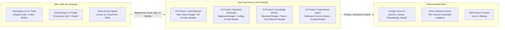

#  Apigee Enterprise AI Gateway

The **Apigee Enterprise AI Gateway** is a declarative framework for operating and governing AI traffic on Google Cloud Apigee.

Instead of building custom API proxies from scratch for every model provider and client SDK, you define your gateway in a single [`values.yaml`](template-guide/configuration.md) file and organize consumption around **AI Products**.

---

## Core Concepts

-   **1. Declarative Gateway Configuration (`values.yaml`)**

    ---

    Define your model catalog, routing rules, and security guardrails in a single YAML file. The framework compiles a complete, production-ready Apigee bundle in seconds—start in 15 lines of YAML and turn on advanced capabilities as your needs grow.

-   **2. The AI Product Model (Personas & Multi-Tenancy)**

    ---

    Package model access, token budgets, and rate limits into reusable **AI Products** (backed by Apigee API Products) aligned to how your organization works—such as **Knowledge Workers**, **Developers**, **Lead AI Engineers**, or **Autonomous Agents**.

-   **3. Universal Client & Model Compatibility**

    ---

    Developers and agents connect using their preferred tools (`Claude Code`, `Codex`, Anthropic SDK, OpenAI SDK, or Google GenAI SDK), and the gateway translates requests and streams across **Vertex AI (Gemini, Claude, Llama, Mistral)**, **Direct OpenAI**, and **self-hosted models**.

-   **4. Invoice-Accurate Cost Attribution & Spend Control**

    ---

    Calculate exact dollar costs (including prompt cache read/write rates and internal reasoning tokens) across every model, AI Product persona, and department, with out-of-the-box Looker Studio dashboards.

---

## How the Framework Fits Together

```mermaid
graph LR
    subgraph Callers["Who Calls the Gateway"]
        C1["Developers & CLI Tools<br/>(Claude Code, Codex, SDKs)"]
        C2["Internal Apps & Portals<br/>(Corporate SSO / OAuth)"]
        C3["Autonomous Agents<br/>(Vertex AI, Cloud Run, GKE)"]
    end

    subgraph Products["How You Govern (AI Products)"]
        P1["AI Product: Lead Engineer<br/>High Token Budget • All Frontier Models"]
        P2["AI Product: Standard Developer<br/>Balanced Budget • Coding & Chat Models"]
        P3["AI Product: Knowledge Worker<br/>Standard Budget • Fast & Cost-Efficient Models"]
        P4["AI Product: Autonomous Agent<br/>Dedicated Service Quota • Scoped Models"]
    end

    subgraph Backends["Where Models Run"]
        B1["Google Vertex AI<br/>(Gemini, Claude, Embeddings, MaaS)"]
        B2["Direct OpenAI & Azure<br/>(Per-Tenant Credential Isolation)"]
        B3["Self-Hosted Clusters<br/>(vLLM, Ollama)"]
    end

    Callers -->|"Mapped by Group, App, or Identity"| Products
    Products -->|"Routed, Sanitized & Rated"| Backends
```

---

## Explore the Guides

| Step | Guide | What You Will Accomplish |
| :--- | :--- | :--- |
| **Step 1** | **[5-Minute Quickstart](getting-started/quickstart-template.md)** | Render and deploy a working AI Gateway from a minimal 15-line `values.quickstart.yaml` file. |
| **Step 2** | **[AI Products, Tenancy & Auth](architecture/security.md)** | Design your **AI Product** tiers for personas and teams, and connect API Keys, Corporate SSO (Okta / Entra / Ping), or GCP Agent identities. |
| **Step 3** | **[Models & Providers](template-guide/custom-urls.md)** | Add Vertex AI Gemini & Claude, Model Garden MaaS (Llama, Mistral), Direct OpenAI (with per-tenant keys), Embeddings, or self-hosted vLLM. |
| **Step 4** | **[Quotas, Budgets & Cost Control](architecture/monetization.md)** | Configure rolling token allowances, per-model caps, shared department budgets, temporary overrides, and **Invoice-Accurate Cost Attribution**. |
| **Step 5** | **[Smart Routing & Content Safety](architecture/routing.md)** | Set up transparent model aliases, cost tiers, fallback chains, complexity-based routing (`auto:judge`), and GCP Model Armor sanitization. |

