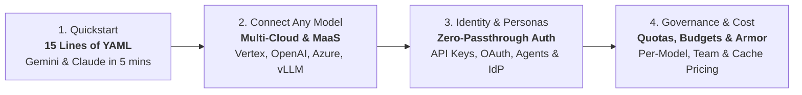

#  Apigee Enterprise AI Gateway

Welcome to the documentation for the **Enterprise AI Gateway** on Google Cloud Apigee.

The goal of this solution is simple: **make adopting Apigee as a full-featured Enterprise AI Gateway effortless.** You can start with a **15-line YAML file** in 5 minutes and progressively turn on enterprise authentication, persona-based token quotas, multi-provider routing, and cost governance without writing custom XML policies.

---

## Progressive Adoption Journey

```mermaid
graph LR
    Step1["1. Quickstart<br/><b>15 Lines of YAML</b><br/>Gemini & Claude in 5 mins"] --> Step2["2. Connect Any Model<br/><b>Multi-Cloud & MaaS</b><br/>Vertex, OpenAI, Azure, vLLM"]
    Step2 --> Step3["3. Identity & Personas<br/><b>Zero-Passthrough Auth</b><br/>API Keys, OAuth, Agents & IdP"]
    Step3 --> Step4["4. Governance & Cost<br/><b>Quotas, Budgets & Armor</b><br/>Per-Model, Team & Cache Pricing"]
```

| Stage | Goal | Where to Start |
| :--- | :--- | :--- |
| **Stage 1: Deploy in 5 Minutes** | Point Claude Code, Codex, OpenAI SDK, or Vertex ADK to Apigee with zero code changes. | **[5-Minute Quickstart](getting-started/quickstart-template.md)** |
| **Stage 2: Add Models & Endpoints** | Connect Vertex Gemini/Claude, Vertex MaaS (`meta/`, `mistralai/`), Direct OpenAI, self-hosted vLLM, and `/v1/embeddings`. | **[Models & Custom URLs](template-guide/custom-urls.md)** |
| **Stage 3: API Products & Persona Auth** | Govern **10,000+ users and agents with just 3–5 Apigee API Products** (avoiding high-cardinality per-user provisioning) while keeping isolated per-user quota buckets (`<1ms` L1 cache). | **[API Products & Persona Auth](architecture/security.md)** |
| **Stage 4: Quotas, Rate Limits & Cost** | Enforce Per-Model Quotas, 4h/7d Windows, Shared Team Budgets, Time-Bound Exceptions, Burst/Concurrency Limits, and Cache-Aware Monetization. | **[Quotas, Budgets & Cost](architecture/monetization.md)** |
| **Stage 5: Smart Routing & Safety** | Classify prompt complexity dynamically (`auto:judge`) and sanitize prompts/responses with GCP Model Armor. | **[Smart Routing & LLM Judge](architecture/routing.md)** |

---

## What Makes This Architecture Different?

-   **API Products as Persona Tiers (Zero Per-User Bloat)**

    ---

    Instead of syncing 10,000 individual employees into the gateway, define **3 to 5 Apigee API Products** (`lead-ai-engineer`, `power-developer`, `developer-default`, `contractor-restricted`). Policy management stays low-cardinality, while runtime quota counters (`rate_limit_client_id`) remain strictly isolated per individual user.

-   **Any Client Credential &rarr; One API Product Model**

    ---

    Whether callers present **API Keys** (`x-apikey`/`x-api-key`), **Apigee OAuth**, **GCP Agent Identity (`ya29.*`)**, or **Corporate SSO (Okta / Ping / Entra ID)**, every credential resolves to an **API Product** and is cached in Apigee's L1 token store (`<1ms` repeat-call latency).

-   **Universal 4×3 Protocol & Embeddings Transcoding**

    ---

    Exposes `/v1/messages` (Anthropic), `/v1/chat/completions` (OpenAI), `/v1/embeddings` (Embeddings), `/ai-gateway` (Native Vertex/ADK), and `/v1/models` — translating requests, tool calls, thinking blocks, and SSE streams across any backend.

-   **Layered Quotas, Team Budgets & Rate Limits**

    ---

    Combine **Per-Model LLM Operation Quotas**, **4h + 7d Rolling Token Windows**, **Shared Team Budgets**, **Time-Bound Individual Exceptions**, **Burst Rate Limits**, and **Active Stream Concurrency Semaphores** with protocol-native `429` diagnostics.

-   **Invoice-Accurate Cache & Reasoning Cost Engine**

    ---

    Extracts and rates **uncached input**, **cache read** (`0.10x`–`0.50x`), **cache write** (`1.25x`), and **thinking/reasoning tokens** across both non-streaming and SSE streaming responses.

-   **Zero-Overhead Modular Template**

    ---

    Driven by a single `values.yaml`. Disabled features are completely omitted from the compiled proxy bundle so you only run the policies you need.

---

## Quick Navigation

-   **[5-Minute Quickstart](getting-started/quickstart-template.md)**

    ---

    Deploy a working AI Gateway bundle using the minimal 15-line starter configuration.

-   **[`values.yaml` Reference](template-guide/configuration.md)**

    ---

    Complete schema reference for gateway metadata, auth personas, quotas, rate limits, models, and pricing.

-   **[Feature Toggles & Decision Matrix](template-guide/feature-flags.md)**

    ---

    Understand which optional features to turn on for your use case and what they compile under the hood.

-   **[API Products & Persona Auth](architecture/security.md)**

    ---

    How the API Product Persona abstraction, IdP Opaque/JWT Token Import, and GCP Model Armor work.

