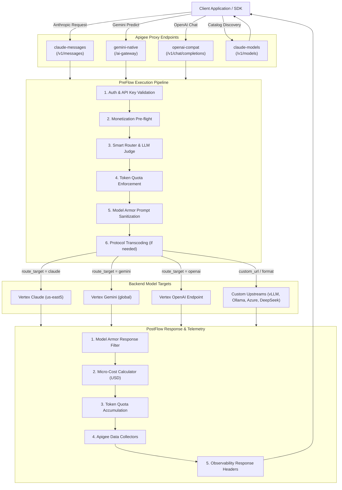

# 📁 Native Proxy Bundle Structure

For users who want to work directly with the raw Apigee API proxy, the `apiproxy/` directory contains the complete, production-ready bundle.

---

## Directory Layout

```text
apiproxy/
├── ai-gateway.xml                 # Master Proxy Manifest & Descriptor
├── proxies/                       # Ingress Proxy Endpoints (4 files)
│   ├── claude-messages.xml        # /v1/messages (Anthropic format)
│   ├── gemini-native.xml          # /ai-gateway (Native Gemini & ADK)
│   ├── openai-compat.xml          # /v1/chat/completions (OpenAI format)
│   └── claude-models.xml          # /v1/models (Catalog discovery)
├── targets/                       # Backend Target Endpoints (4 files)
│   ├── claude.xml                 # Vertex Claude (streamRawPredict)
│   ├── gemini.xml                 # Vertex Gemini generateContent (Translated)
│   ├── gemini-native-target.xml   # Vertex Gemini predict (Native)
│   └── gemini-openai-compat.xml   # Vertex OpenAI chat/completions
├── policies/                      # XML Policy Definitions (38 policies)
│   ├── VA-ApiKey.xml              # VerifyAPIKey
│   ├── MLC-EnforceMonetizationLimits.xml # Monetization Pre-flight
│   ├── SC-LLMJudge.xml            # ServiceCallout (Gemini Judge)
│   ├── SUP-SanitizeUserPrompt.xml # Model Armor Ingress Filter
│   ├── SMR-SanitizeModelResponse.xml # Model Armor Egress Filter
│   ├── LTQ-EnforceOnly.xml        # Token Quota Enforcement
│   ├── LTQ-CountOnly.xml          # Token Quota Accumulation
│   └── ...
└── resources/
    ├── jsc/                       # JavaScript Resources (17 scripts)
    ├── oas/                       # OpenAPI 3.0 Specs for OASValidation
    └── properties/                # PropertySets (Model routing, pricing, config)
        ├── model_locations.properties
        ├── monetization_rates.properties
        ├── config.properties
        └── extract_expressions.properties
```

---

## 1. Master Proxy Manifest (`ai-gateway.xml`)

Defines proxy metadata, base paths, and references to all child policies, proxy endpoints, targets, and resources:

```xml
<?xml version="1.0" encoding="UTF-8" standalone="yes"?>
<APIProxy revision="1" name="ai-gateway">
  <DisplayName>ai-gateway</DisplayName>
  <Description>Apigee Enterprise AI Gateway</Description>
  <Basepaths>/v1/messages</Basepaths>
  <Basepaths>/ai-gateway</Basepaths>
  <Basepaths>/v1/chat/completions</Basepaths>
  <Basepaths>/v1/models</Basepaths>
  ...
</APIProxy>
```

---

## 2. PropertySets (`resources/properties/`)

The proxy uses 4 runtime property sets:

* **`model_locations.properties`**: Master model catalog, routing targets, regions, custom URLs, and alias maps.
* **`monetization_rates.properties`**: Input and output token pricing matrix in USD per 1M tokens.
* **`config.properties`**: Environment variables, GCP Project ID, and Model Armor template identifiers.
* **`extract_expressions.properties`**: JSONPath expressions for extracting usage token counts.

---

## 3. Appendix: End-to-End Pipeline Execution Flow

For engineers inspecting the exact runtime flow through Apigee's PreFlow, Target routing, and PostFlow:



