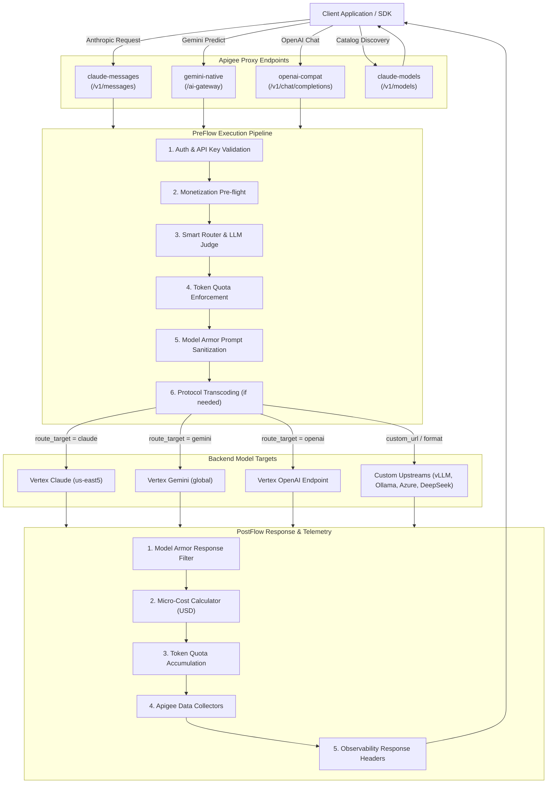

# 📁 Native Proxy Bundle Structure

For users who want to work directly with the raw Apigee API proxy, the `apiproxy/` directory contains the complete, production-ready bundle.

---

## Directory Layout

```text
apiproxy/
├── ai-gateway.xml                 # Master Proxy Manifest & Descriptor
├── proxies/                       # Ingress Proxy Endpoints (5 files)
│   ├── claude-messages.xml        # /v1/messages (Anthropic Messages & Claude Code)
│   ├── openai-compat.xml          # /v1/chat/completions (OpenAI Chat & Codex)
│   ├── openai-embeddings.xml      # /v1/embeddings (OpenAI & Vertex AI Embeddings)
│   ├── gemini-native.xml          # /ai-gateway (Native Vertex Gemini & ADK)
│   └── claude-models.xml          # /v1/models (Dynamic Catalog Discovery)
├── targets/                       # Backend Target Endpoints (5 files)
│   ├── claude.xml                 # Vertex Claude (streamRawPredict) & Custom Anthropic
│   ├── gemini.xml                 # Vertex Gemini (generateContent / predict)
│   ├── gemini-native-target.xml   # Vertex Gemini Native Predict / ADK
│   ├── gemini-openai-compat.xml   # Vertex OpenAI Chat & Model Garden MaaS (Llama/Mistral)
│   └── openai-custom.xml          # Direct OpenAI (api.openai.com), Azure, DeepSeek & vLLM
├── policies/                      # XML Policy Definitions (51 default + 4 opt-in in template)
│   ├── JS-extract-auth-credentials.xml   # 4-Option Auth Credential Extractor
│   ├── VA-ApiKey.xml                     # Option 1: VerifyAPIKey
│   ├── OA-VerifyAccessToken.xml          # Option 2 & 4 Fast-Path: OAuthV2 VerifyAccessToken
│   ├── SC-VerifyGoogleTokenInfo.xml      # Option 3: GCP Agent Identity TokenInfo
│   ├── SC-IntrospectOpaqueToken.xml      # Option 4A: Enterprise IdP Opaque RFC 7662
│   ├── VJ-VerifyIdpJwt.xml               # Option 4B: Enterprise IdP JWT (JWKS)
│   ├── OA-SaveTokenAttributes.xml        # Option 4: External Token Import (<1ms L1 Cache)
│   ├── RF-Unauthorized.xml               # Zero-Passthrough 401 Reject
│   ├── MLC-EnforceMonetizationLimits.xml # Monetization Pre-flight Check
│   ├── SC-LLMJudge.xml                   # ServiceCallout (Gemini Classifier)
│   ├── SUP-SanitizeUserPrompt.xml        # Model Armor Ingress Filter
│   ├── SMR-SanitizeModelResponse.xml     # Model Armor Egress & SSE Filter
│   ├── LTQ-EnforceOnly.xml               # Primary & Per-Model Token Quota Enforcement
│   ├── LTQ-CountOnly.xml                 # Primary & Per-Model Token Quota Accumulation
│   └── ...
└── resources/
    ├── jsc/                       # JavaScript Resources (20 IIFE-encapsulated scripts)
    ├── oas/                       # OpenAPI 3.0 Specs for Request Validation (4 files)
    └── properties/                # PropertySets (Model routing, pricing, auth, config)
        ├── model_locations.properties
        ├── monetization_rates.properties
        ├── config.properties
        └── extract_expressions.properties
```

---

## 1. Master Proxy Manifest (`ai-gateway.xml`)

Defines proxy metadata, base paths, and references to all child policies, proxy endpoints, targets, and resources:

```xml
<?xml version="1.0" encoding="UTF-8" standalone="yes"?>
<APIProxy revision="1" name="ai-gateway">
  <DisplayName>ai-gateway</DisplayName>
  <Description>Apigee Enterprise AI Gateway</Description>
  <Basepaths>/v1/messages</Basepaths>
  <Basepaths>/ai-gateway</Basepaths>
  <Basepaths>/v1/chat/completions</Basepaths>
  <Basepaths>/v1/embeddings</Basepaths>
  <Basepaths>/v1/models</Basepaths>
  ...
</APIProxy>
```

---

## 2. PropertySets (`resources/properties/`)

The proxy uses 4 runtime property sets:

* **`model_locations.properties`**: Master model catalog, routing targets, regions, custom URLs, and alias maps.
* **`monetization_rates.properties`**: Input and output token pricing matrix in USD per 1M tokens.
* **`config.properties`**: Environment variables, GCP Project ID, and Model Armor template identifiers.
* **`extract_expressions.properties`**: JSONPath expressions for extracting usage token counts.

---

## 3. Appendix: End-to-End Pipeline Execution Flow

For engineers inspecting the exact runtime flow through Apigee's PreFlow, Target routing, and PostFlow:


```mermaid
graph TD
    Client["Client Application / SDK"]

    subgraph Ingress["Apigee Proxy Endpoints"]
        EP_Claude["claude-messages<br/>(/v1/messages)"]
        EP_Gemini["gemini-native<br/>(/ai-gateway)"]
        EP_OpenAI["openai-compat<br/>(/v1/chat/completions)"]
        EP_Models["claude-models<br/>(/v1/models)"]
    end

    subgraph Pipeline["PreFlow Execution Pipeline"]
        Auth["1. Auth & API Key Validation"]
        MLC["2. Monetization Pre-flight"]
        Judge["3. Smart Router & LLM Judge"]
        Quota["4. Token Quota Enforcement"]
        Armor["5. Model Armor Prompt Sanitization"]
        Xlate["6. Protocol Transcoding (if needed)"]
        
        Auth --> MLC --> Judge --> Quota --> Armor --> Xlate
    end

    subgraph Targets["Backend Model Targets"]
        T_Claude["Vertex Claude (us-east5)"]
        T_Gemini["Vertex Gemini (global)"]
        T_OpenAI["Vertex OpenAI Endpoint"]
        T_Custom["Custom Upstreams (vLLM, Ollama, Azure, DeepSeek)"]
    end

    Client -->|Anthropic Request| EP_Claude
    Client -->|Gemini Predict| EP_Gemini
    Client -->|OpenAI Chat| EP_OpenAI
    Client -->|Catalog Discovery| EP_Models

    EP_Claude --> Pipeline
    EP_Gemini --> Pipeline
    EP_OpenAI --> Pipeline

    Xlate -->|route_target = claude| T_Claude
    Xlate -->|route_target = gemini| T_Gemini
    Xlate -->|route_target = openai| T_OpenAI
    Xlate -->|custom_url / format| T_Custom

    subgraph Egress["PostFlow Response & Telemetry"]
        SMR["1. Model Armor Response Filter"]
        Calc["2. Micro-Cost Calculator (USD)"]
        LTQ_Cnt["3. Token Quota Accumulation"]
        DC["4. Apigee Data Collectors"]
        Hdrs["5. Observability Response Headers"]
        
        SMR --> Calc --> LTQ_Cnt --> DC --> Hdrs
    end

    T_Claude --> Egress
    T_Gemini --> Egress
    T_OpenAI --> Egress
    T_Custom --> Egress
    Hdrs --> Client
    EP_Models --> Client
```

