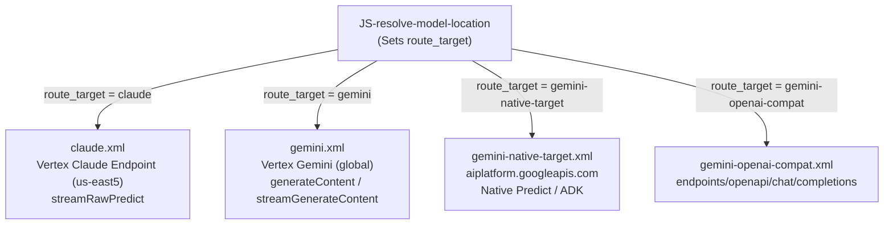

# 🎯 Target Endpoints & Google Cloud Auth

The gateway routes requests to 4 specialized Target Endpoints defined in `apiproxy/targets/`.

---

## 1. Target Endpoint Catalog



---

## 2. Google Cloud Authentication (`GoogleAccessToken`)

All targets connecting to Google Vertex AI use native Apigee IAM token acquisition:

```xml
<HTTPTargetConnection>
  <Properties>
    <Property name="io.timeout.millis">300000</Property>
  </Properties>
  <Authentication>
    <GoogleAccessToken>
      <Scopes>
        <Scope>https://www.googleapis.com/auth/cloud-platform</Scope>
      </Scopes>
    </GoogleAccessToken>
  </Authentication>
  <URL>https://{endpoint_host}/v1/projects/{propertyset.config.project_id}/locations/{model_location}/publishers/anthropic/models/{model}:streamRawPredict</URL>
</HTTPTargetConnection>
```

* **No Service Account Keys:** Eliminates hardcoded service account keys; tokens are generated dynamically by Apigee runtime using the attached Google Cloud Service Account.
* **Dynamic Hosts & Locations:** `{endpoint_host}` and `{model_location}` variables allow dynamic routing across regions without modifying the target XML.
