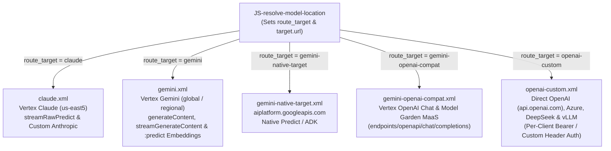

# 🎯 Target Endpoints & Upstream Auth

The gateway routes requests across **5 specialized Target Endpoints** defined in `apiproxy/targets/` (and `templates/ai-gateway/targets/`).

---

## 1. Target Endpoint Catalog


```mermaid
graph TD
    Router["JS-resolve-model-location<br/>(Sets route_target & target.url)"]

    T_Claude["claude.xml<br/>Vertex Claude (us-east5)<br/>streamRawPredict & Custom Anthropic"]
    T_Gemini["gemini.xml<br/>Vertex Gemini (global / regional)<br/>generateContent, streamGenerateContent & :predict Embeddings"]
    T_GeminiNat["gemini-native-target.xml<br/>aiplatform.googleapis.com<br/>Native Predict / ADK"]
    T_OpenAIVertex["gemini-openai-compat.xml<br/>Vertex OpenAI Chat & Model Garden MaaS<br/>(endpoints/openapi/chat/completions)"]
    T_OpenAICustom["openai-custom.xml<br/>Direct OpenAI (api.openai.com), Azure, DeepSeek & vLLM<br/>(Per-Client Bearer / Custom Header Auth)"]

    Router -->|route_target = claude| T_Claude
    Router -->|route_target = gemini| T_Gemini
    Router -->|route_target = gemini-native-target| T_GeminiNat
    Router -->|route_target = gemini-openai-compat| T_OpenAIVertex
    Router -->|route_target = openai-custom| T_OpenAICustom
```

| Target Endpoint | Upstream Destination | Upstream Auth Mechanism |
| :--- | :--- | :--- |
| **`claude.xml`** | Vertex AI Anthropic (`:streamRawPredict`) or Direct Anthropic (`custom_url`) | `<GoogleAccessToken>` (or custom `x-api-key` header) |
| **`gemini.xml`** | Vertex AI Gemini (`:generateContent`, `:streamGenerateContent`) & Vertex Embeddings (`:predict`) | `<GoogleAccessToken>` |
| **`gemini-native-target.xml`** | Native Vertex AI `/ai-gateway` pass-through for Google GenAI SDK / ADK | `<GoogleAccessToken>` |
| **`gemini-openai-compat.xml`** | Vertex AI OpenAI Compatibility API & Model Garden MaaS (`meta/llama-*`, `mistralai/*`) | `<GoogleAccessToken>` |
| **`openai-custom.xml`** | Direct OpenAI (`api.openai.com`), Azure OpenAI, DeepSeek, or self-hosted vLLM/Ollama | `AM-SetOpenAIAuth` (`Authorization: Bearer`, `OpenAI-Organization`, `OpenAI-Project`, or custom header) |

---

## 2. Google Cloud Authentication (`GoogleAccessToken`)

All targets connecting to Google Vertex AI (`claude`, `gemini`, `gemini-native-target`, `gemini-openai-compat`) use native Apigee IAM token acquisition:

```xml
<HTTPTargetConnection>
  <Properties>
    <Property name="io.timeout.millis">300000</Property>
    <Property name="response.streaming.enabled">true</Property>
  </Properties>
  <Authentication>
    <GoogleAccessToken>
      <Scopes>
        <Scope>https://www.googleapis.com/auth/cloud-platform</Scope>
      </Scopes>
    </GoogleAccessToken>
  </Authentication>
  <URL>https://{endpoint_host}/v1/projects/{propertyset.config.project_id}/locations/{model_location}/publishers/{model_publisher}/models/{model}:{gemini_action}</URL>
</HTTPTargetConnection>
```

* **No Service Account Keys:** Eliminates hardcoded service account keys; tokens are generated dynamically by the Apigee runtime using the attached Google Cloud Service Account.
* **Dynamic Hosts, Publishers & Actions:** `{endpoint_host}`, `{model_location}`, `{model_publisher}`, and `{gemini_action}` (`generateContent`, `streamGenerateContent?alt=sse`, or `predict` for embeddings) allow dynamic routing across regions and model families without modifying target XML.

---

## 3. Direct OpenAI & Custom Provider Authentication (`openai-custom.xml`)

Unlike the Vertex AI targets, `openai-custom.xml` omits `<GoogleAccessToken>` so Apigee does not overwrite the `Authorization` header with a GCP IAM token. Instead, `AM-SetOpenAIAuth` injects:
* `Authorization: Bearer {target_auth_token}` (or a custom header such as `api-key` for Azure OpenAI)
* `OpenAI-Organization: {openai_org_id}` (if configured on the Developer App, Developer, API Product, or PropertySet)
* `OpenAI-Project: {openai_project_id}` (if configured on the Developer App, Developer, API Product, or PropertySet)

