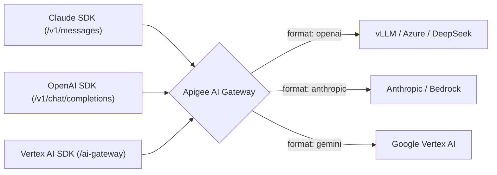

# Custom Providers, URLs & Protocol Routing

The Apigee AI Gateway allows you to route requests to **any model provider**, **self-hosted clusters (vLLM, Ollama)**, **third-party APIs (DeepSeek, Mistral, Azure)**, and **regional cloud endpoints** while preserving full client compatibility.


---

## 1. Core Concept: Publisher vs. Wire Protocol

A common point of confusion is the difference between a **Publisher** and a **Wire Protocol (Format)**:

* **Publisher (`publisher`)**: An arbitrary metadata label indicating who creates or hosts the model (e.g. `openai`, `azure`, `meta`, `deepseek`, `mistral`, `anthropic`, `google`, `custom`). Publishers are used for cataloging, observability, and billing.
* **Wire Protocol (`format`)**: The JSON schema and HTTP protocol used across the wire (`openai`, `anthropic`, `gemini`).

### Provider Configuration Cheat Sheet

| Provider / Service | Recommended `publisher` | Required `format` | Common Auth Type |
| :--- | :--- | :---: | :--- |
| **OpenAI / Azure OpenAI** | `openai` or `azure` | `openai` | Bearer Token or `api-key` header |
| **DeepSeek / Mistral AI** | `deepseek` or `mistral` | `openai` | Bearer Token |
| **vLLM / Ollama (Self-Hosted)** | `custom` or `meta` | `openai` | Bearer Token or None |
| **Anthropic Claude (Direct / Bedrock)** | `anthropic` | `anthropic` | `x-api-key` header or Vertex IAM |
| **Google Vertex AI / AI Studio** | `google` | `gemini` | Google Cloud IAM / ADC |

> [!TIP]
> **No Need to Specify `target`:** The gateway automatically infers the internal Apigee target pipeline from the model's `format`. You only need to specify `format`, `custom_url`, and optional `auth`.


---

## 2. Bringing Any Model Provider

### Pattern A: Self-Hosted LLMs (vLLM / Kubernetes / Ollama)
Point an OpenAI-compatible endpoint directly to your internal cluster:

```yaml
models:
  - name: "llama-3-70b"
    displayName: "Meta Llama 3 70B (vLLM Cluster)"
    publisher: "meta"                    # Any publisher label
    format: "openai"                     # Standard OpenAI wire protocol
    custom_url: "https://vllm.internal.corp/v1/chat/completions"
    auth:
      type: "bearer"
      token: "sk-internal-vllm-secret-token"
    pricing:
      input_rate: 0.050
      output_rate: 0.150
```

---

### Pattern B: DeepSeek API (or Groq, Together AI, Mistral)
Connect directly to third-party model providers:

```yaml
models:
  - name: "deepseek-r1"
    displayName: "DeepSeek R1 (API)"
    publisher: "deepseek"
    format: "openai"
    custom_url: "https://api.deepseek.com/v1/chat/completions"
    auth:
      type: "bearer"
      token: "sk-deepseek-api-key"
    pricing:
      input_rate: 0.550
      output_rate: 2.190
```

---

### Pattern C: Azure OpenAI Deployments
Connect to an Azure OpenAI deployment using Azure's `api-key` header:

```yaml
models:
  - name: "azure-gpt-4o"
    displayName: "GPT-4o (Azure OpenAI)"
    publisher: "azure"
    format: "openai"
    custom_url: "https://my-resource.openai.azure.com/openai/deployments/gpt-4o/chat/completions?api-version=2024-08-01-preview"
    auth:
      type: "header"
      header_name: "api-key"
      token: "azure-secret-api-key-123"
    pricing:
      input_rate: 2.500
      output_rate: 10.000
```

---

### Pattern D: Direct Anthropic Claude API
Route Claude requests to Anthropic's cloud with `x-api-key`:

```yaml
models:
  - name: "claude-3-7-sonnet"
    displayName: "Claude 3.7 Sonnet (Anthropic Direct)"
    publisher: "anthropic"
    format: "anthropic"
    custom_url: "https://api.anthropic.com/v1/messages"
    auth:
      type: "header"
      header_name: "x-api-key"
      token: "sk-ant-api-key-xyz"
    pricing:
      input_rate: 3.000
      output_rate: 15.000
```

---

### Pattern E: Regional Vertex AI Endpoints
Route compliance-sensitive workloads to specific Google Cloud regions:

```yaml
models:
  - name: "gemini-2.5-pro-eu"
    displayName: "Gemini 2.5 Pro (Europe)"
    publisher: "google"
    format: "gemini"
    region: "europe-west1"      # Resolves to europe-west1-aiplatform.googleapis.com
    pricing:
      input_rate: 1.250
      output_rate: 5.000
```

---

## 3. Upstream Authentication Options

The gateway supports multiple upstream authentication schemes configured under `auth:`:

### 1. Bearer Token (`type: "bearer"`)
Injects `Authorization: Bearer <token>` into the upstream request:
```yaml
auth:
  type: "bearer"
  token: "sk-secret-key"
```

### 2. Custom Header (`type: "header"`)
Injects any custom header (e.g. `api-key` for Azure, `x-api-key` for Anthropic):
```yaml
auth:
  type: "header"
  header_name: "api-key"
  token: "secret-key-value"
```

### 3. Dynamic PropertySet / Flow Variable Reference (`token_ref`)
Dynamically resolves the credential at runtime from an Apigee PropertySet or flow variable:
```yaml
auth:
  type: "bearer"
  token_ref: "propertyset.config.vllm_api_key"
```

---

## 4. Cross-Protocol Transcoding Matrix
 
Regardless of how the model is hosted, clients can interact with it using any client SDK:



### 3×3 Compatibility Grid

| Ingress Client Endpoint | Target Backend: **OpenAI**<br>*(vLLM / Azure / DeepSeek)* | Target Backend: **Anthropic**<br>*(Claude API / Vertex)* | Target Backend: **Gemini**<br>*(Google Vertex AI)* |
| :--- | :---: | :---: | :---: |
| **Claude SDK**<br>`POST /v1/messages` | ✅ **Full Transcoding**<br>*(Claude &rarr; OpenAI schema + SSE)* | ✅ **Native Passthrough**<br>*(Direct routing + auth injection)* | ✅ **Full Transcoding**<br>*(Claude &rarr; Gemini schema + SSE)* |
| **OpenAI SDK**<br>`POST /v1/chat/completions` | ✅ **Native Passthrough**<br>*(Direct routing + auth injection)* | ✅ **Full Transcoding**<br>*(OpenAI &rarr; Claude schema + SSE)* | ✅ **Full Transcoding**<br>*(OpenAI &rarr; Gemini schema + SSE)* |
| **Vertex AI SDK**<br>`POST /ai-gateway` | ℹ️ **Via OpenAI Endpoint**<br>*(Clients use `/v1/chat/completions`)* | ✅ **Native Passthrough**<br>*(Direct to Claude `:rawPredict`)* | ✅ **Native Passthrough**<br>*(Direct to Gemini `:generateContent`)* |


